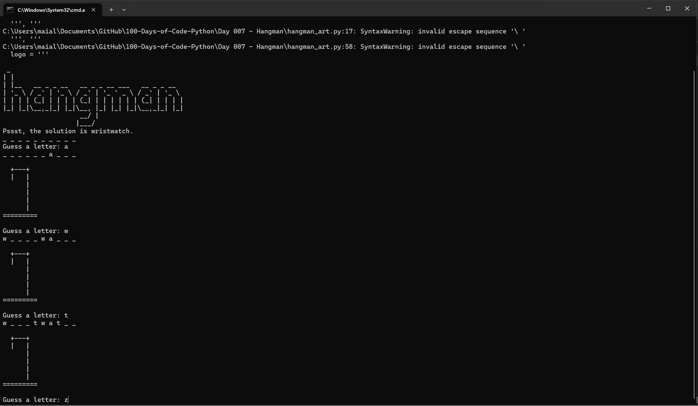

# Day 7: Hangman Game

This is a simple command-line implementation of the classic Hangman game, where players guess letters in a word until they either guess the word correctly or run out of attempts.

## Demo


## Files in the Project

- **hangman_art.py**: Contains the ASCII art used to display the Hangman stages and the game logo.
- **hangman_words.py**: Contains a list of words that the program randomly selects from for the player to guess.
- **hangman.py**: The main script to run the Hangman game. It handles the game logic, including user input, checking guesses, updating the display, and determining the game's outcome.
- **Hangman+Flowchart+1.png**: A flowchart image illustrating the logic and flow of the Hangman game. Useful for understanding how the game processes and decisions are made.

## How to Run

1. **Prerequisites**: Ensure you have Python installed on your system. This game runs on Python 3.
2. **Run the Game**: 
   - Open a terminal or command prompt.
   - Navigate to the directory containing the `hangman.py` file.
   - Run the script using the following command:
     ```
     python hangman.py
     ```
   - Follow the on-screen instructions to guess letters and try to figure out the hidden word.

## How the Game Works

- At the start of the game, a random word is selected from the `hangman_words.py` file.
- The player is asked to guess a letter. If the letter is in the word, it is revealed in its correct position(s). If the letter is not in the word, the player loses one life.
- The game continues until the player has guessed all the letters in the word or has run out of lives.
- The ASCII art in `hangman_art.py` visually represents the player's progress and the number of lives remaining.

## Game Flowchart

The flowchart in `Hangman+Flowchart+1.png` visually represents the decision-making process of the game. It provides a high-level overview of the game's logic, from starting the game, through each guess, to the end conditions (win or lose).

## Customization

- **Words**: You can customize the game by adding or removing words from the `hangman_words.py` file.
- **Art**: Modify the `hangman_art.py` file to change the appearance of the Hangman stages and logo.


---

Enjoy playing Hangman!