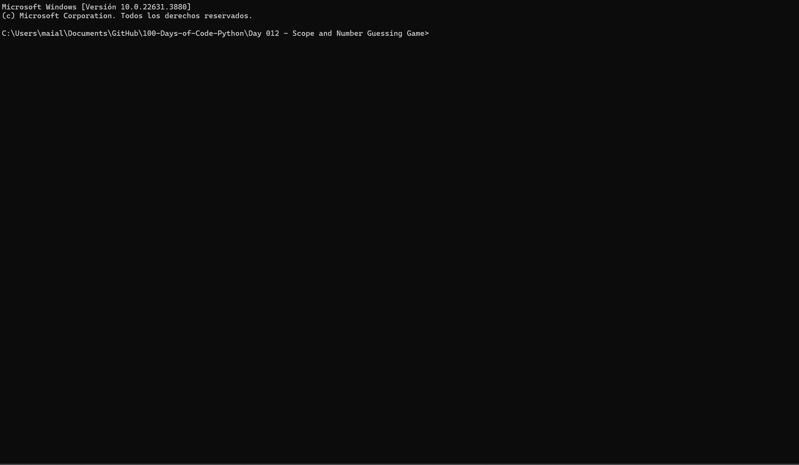

# Day 12: Number Guessing Game

Welcome to Day 12 of your Python learning journey! Today, I explored the concept of scope and applied it to create a Number Guessing Game. Below is an overview of the files I created and the details of the Number Guessing Game project.

## Demo

## Files in This Folder

### `main.py`

This script implements the Number Guessing Game where players guess a randomly generated number between 1 and 100. The game includes difficulty levels and provides feedback based on user guesses.

- **Key Concepts**:
  - Scope of variables and functions.
  - Random number generation.
  - Conditional statements and loops.
  - User input handling.

- **How it Works**:
  - **Game Initialization**:
    - Prints the game logo.
    - Generates a random number between 1 and 100.
    - Prompts the user to choose a difficulty level (`easy` or `hard`), setting the number of guesses accordingly.
  
  - **Game Logic**:
    - In a loop, the user is prompted to guess the number.
    - Provides feedback whether the guess is too high, too low, or correct.
    - Decrements the number of remaining attempts with each guess.
    - Ends the game if the user guesses correctly or runs out of attempts.
  
  - **Functions**:
    - `guess_result(guess, random_number)`: Compares the user’s guess with the random number and returns appropriate feedback.

- **Example Usage**:
  - Run the script by executing `python main.py`.
  - Choose the difficulty level.
  - Make guesses to find the number, receiving feedback and tracking remaining attempts.
  - The game ends when the user guesses correctly or runs out of attempts.

### `art.py`

This file contains the ASCII art used to display the logo for the Number Guessing Game. It is imported into `main.py` to print the game logo at the start of the game.

## How to Run the Script

1. **Ensure you have Python installed** on your system.
2. **Navigate to the folder** containing these files in your terminal or command prompt.
3. Run the script by typing `python main.py`.
4. Follow the on-screen instructions to play the Number Guessing Game.
