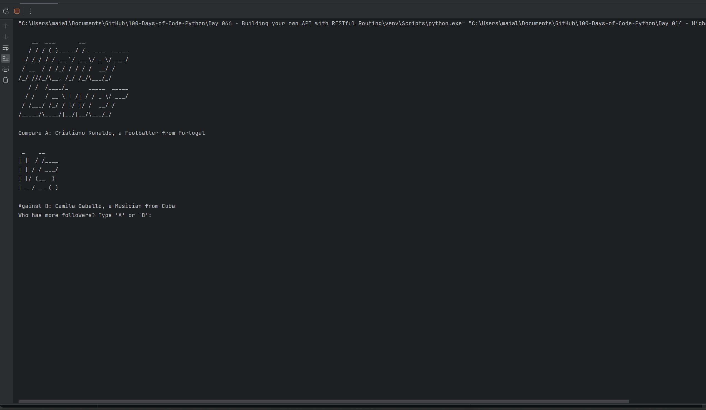

# Day 14: Higher Lower Game

Welcome to Day 14 of your Python learning journey! Today, I worked on creating a Higher Lower Game project. This game challenges users to compare the number of social media followers of two celebrities and guess which one has more followers. The game continues until the user makes an incorrect guess.

## Demo

## Game Features

- **Dynamic Celebrity Comparison**:
  - Randomly selects two celebrities for comparison in each round.
  - Updates the game state based on user input and correct answers.

- **Score Tracking**:
  - Keeps track of the user's score throughout the game.
  - Displays the current score after each correct guess.

- **User Feedback**:
  - Provides immediate feedback on whether the user's guess was correct or incorrect.
  - Shows the final score when the game ends.

## Files in This Folder

### main.py

- **Purpose**: Implements the core game logic for the Higher Lower Game.

#### Content Overview of `main.py`:

1. **Initialization**:
   - Imports necessary modules and data.
   - Initializes the game state, including the score and random selection of two celebrities.

2. **Game Loop**:
   - Continuously runs until the user makes an incorrect guess.
   - Displays two celebrities and their details to the user.
   - Prompts the user to guess which celebrity has more followers.
   - Checks if the user's guess is correct and updates the score.
   - Refreshes the game with new celebrity data if the guess is correct, or ends the game if the guess is incorrect.

3. **Error Handling**:
   - Ensures that the selected celebrities are not the same.
   - Handles user input to ensure valid choices are made.
   - Provides feedback to the user based on their input.

## How to Run the Game

1. **Setup**:
   - Ensure you have Python installed on your system.
   - Place the `art.py`, `game_data.py`, and `main.py` files in the same directory.

2. **Execution**:
   - Open your terminal or command prompt.
   - Navigate to the directory containing the files.
   - Run the game by executing the command: `python main.py`.

3. **Playing the Game**:
   - Follow the on-screen prompts to compare celebrities and guess which one has more followers.
   - Continue playing until you make an incorrect guess, at which point the game will display your final score.

### art.py

- **Purpose**: Contains ASCII art used in the game, including the game logo and the "vs" symbol.

### game_data.py

- **Purpose**: Stores the data of celebrities used in the game. Each celebrity's data includes their name, description, country, and follower count.

