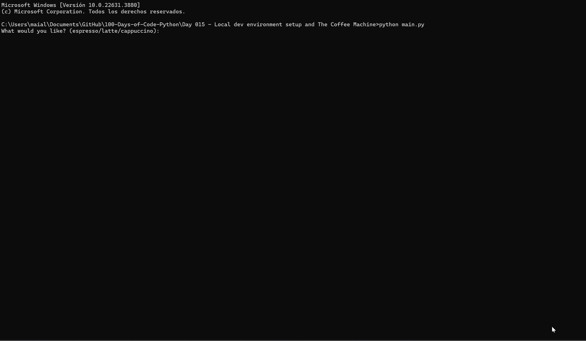

# Day 15: Coffee Machine Project

## Overview

On Day 15, I focused on setting up a local development environment and created a Coffee Machine project in Python. The project simulates a coffee vending machine that accepts user input, processes payments, and manages resources.

## Demo

When the script runs, the user is prompted to choose between espresso, latte, or cappuccino. They are then asked to insert coins. The machine checks if enough resources are available, processes the payment, updates the resources, and returns the appropriate amount of change if needed.



If the user types "report", the current resources and money are displayed. Typing "off" will terminate the program.


## Project Files

### `Coffee+Machine+Program+Requirements.pdf`
This PDF contains the requirements and specifications for the Coffee Machine program.

### `main.py`
This is the main Python script for the Coffee Machine project. It handles user interactions, processes coffee orders, manages resources, and provides feedback to the user.

## Features

- **Menu**: The Coffee Machine offers three types of coffee: Espresso, Latte, and Cappuccino.
- **Resources Management**: Manages the available water, milk, coffee, and money.
- **User Input**: Prompts the user for their choice of coffee, coin inputs, and provides feedback.
- **Resource Check**: Checks if sufficient resources are available before processing an order.
- **Change Calculation**: Calculates and returns change to the user if they provide more money than required.
- **Reporting**: Provides a report of the current resources and money.
- **Exit Option**: Allows the user to turn off the coffee machine.

## How to Run

1. **Setup**: Ensure you have Python installed on your system.
2. **Install Dependencies**: No external libraries are required for this project.
3. **Run the Script**: Execute the script using the following command:

    ```bash
    python main.py
    ```

## Code Explanation

### Menu and Resources

- **MENU**: A dictionary containing coffee types, their ingredients, and costs.
- **resources**: A dictionary tracking available resources and money.

### Functions

- `calculate_change(qu, di, nick, pen, user_selection)`: Computes the change to be returned based on inserted coins and coffee cost.
- `update_resources(user_selection)`: Updates the resource levels after a coffee purchase.
- `print_resources()`: Prints the current state of resources.
- `are_enough_resources(user_selection)`: Checks if there are sufficient resources for the selected coffee.

### Main Loop

- **User Input**: Prompts for coffee selection and coin inputs.
- **Order Processing**: Checks resource availability, processes payment, and updates resources.
- **Report and Exit**: Provides a report on resources or exits the program based on user input.

