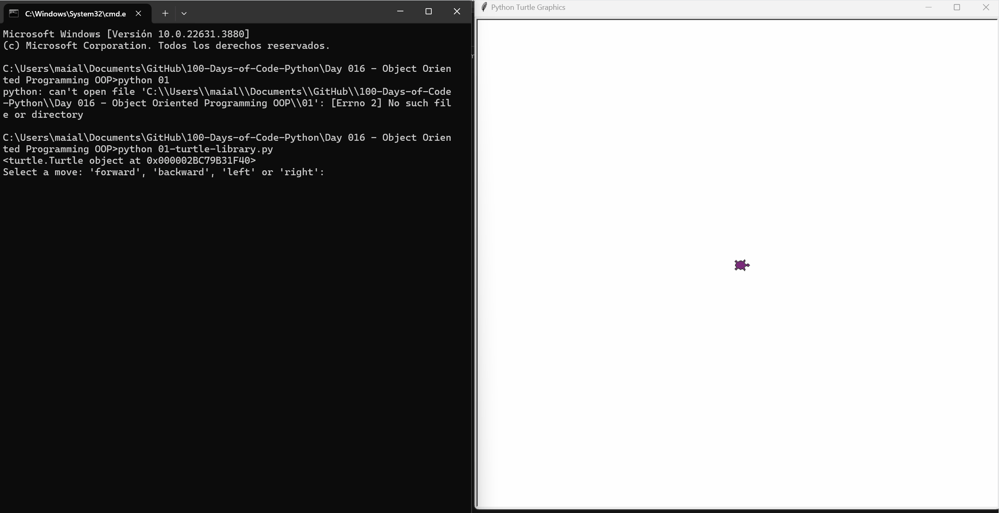
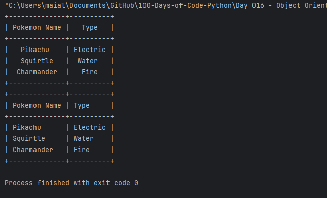
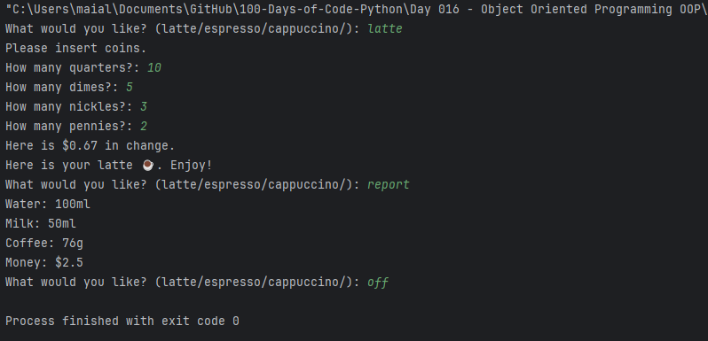

# Day 16: Object-Oriented Programming (OOP) in Python


- [Day 16: Object-Oriented Programming (OOP) in Python](#day-16-object-oriented-programming-oop-in-python)
  - [Overview](#overview)
  - [Projects and Files](#projects-and-files)
    - [`01-turtle-library.py`](#01-turtle-librarypy)
    - [`02-pretty-table.py`](#02-pretty-tablepy)
    - [OOP-based Coffee Machine Project](#oop-based-coffee-machine-project)
      - [Project Structure:](#project-structure)
      - [How to Run the Coffee Machine Project](#how-to-run-the-coffee-machine-project)
  - [Concepts Practiced](#concepts-practiced)


## Overview

On Day 15, I delved into Object-Oriented Programming (OOP) concepts in Python. I practiced with simple projects using the `Turtle` library and `PrettyTable`, followed by implementing an OOP-based Coffee Machine project.

## Projects and Files

### `01-turtle-library.py`
- **Description**: This script demonstrates the use of Python's `turtle` library to create a basic interactive drawing program.
- **Features**:
  - Create and manipulate a turtle object to draw on the screen.
  - Allows user input to control the turtle's movement (`forward`, `backward`, `left`, `right`).
  - Interactive session to perform multiple moves.



### `02-pretty-table.py`
- **Description**: This script showcases the use of the `PrettyTable` library to create and format tables.
- **Features**:
  - Creates a table with Pokémon names and their types.
  - Demonstrates how to add columns and align table data for better readability.



### OOP-based Coffee Machine Project

This project simulates a coffee vending machine using Object-Oriented Programming. The machine handles user input, processes payments, manages resources, and dispenses coffee.



#### Project Structure:
- **`oop-coffee-machine/coffee_maker.py`**:
  - **Description**: Contains the `CoffeeMaker` class, which models the machine that makes the coffee.
  - **Features**:
    - Reports the current resources (water, milk, coffee).
    - Checks if there are sufficient resources to make a selected drink.
    - Deducts the required resources when a coffee is made.

- **`oop-coffee-machine/menu.py`**:
  - **Description**: Contains the `Menu` and `MenuItem` classes, which model the menu and the individual drinks.
  - **Features**:
    - `MenuItem`: Represents a single drink item, including its ingredients and cost.
    - `Menu`: Manages the list of available drinks, and allows searching for drinks by name.

- **`oop-coffee-machine/money_machine.py`**:
  - **Description**: Contains the `MoneyMachine` class, which handles all monetary transactions.
  - **Features**:
    - Processes coin input and calculates the total money received.
    - Checks if the received money is sufficient to cover the cost of the drink.
    - Returns change if applicable and updates the total profit.

- **`oop-coffee-machine/main.py`**:
  - **Description**: The main script that ties together the `CoffeeMaker`, `Menu`, and `MoneyMachine` classes.
  - **Features**:
    - Continuously prompts the user to make a selection, process payments, and dispense drinks.
    - Provides options to generate a report of resources and turn off the machine.

#### How to Run the Coffee Machine Project

1. **Navigate to the project directory**:
    ```bash
    cd oop-coffee-machine
    ```

2. **Run the main script**:
    ```bash
    python main.py
    ```

3. **Interact with the machine**:
    - Choose a drink: `latte`, `espresso`, `cappuccino`.
    - Insert coins as prompted.
    - Generate reports or turn off the machine with `report` or `off`.

## Concepts Practiced

- **Object-Oriented Programming**: Encapsulation of functionality within classes, creation of objects, and interaction between objects.
- **Python Libraries**:
  - `turtle`: Graphical library for creating drawings.
  - `PrettyTable`: For creating and formatting tables.
