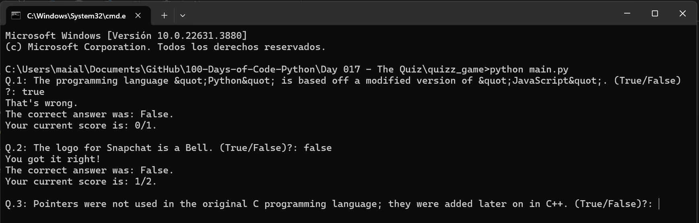

# Day 17: Custom Classes and Quiz Game Project

## Overview

On Day 17, I focused on creating custom classes in Python and implemented a Quiz Game project to reinforce these concepts. This involved building class structures, managing class attributes, and writing methods that operate on class instances.

## Projects and Files

### `01-creating-custom-classes.py`
- **Description**: This script demonstrates the basics of creating custom classes in Python. It includes a simple example of a `User` class.
- **Features**:
  - **User Class**:
    - Attributes: `id`, `username`, `followers`, `following`.
    - Method: `follow()`, which increases the follower count of another user and increments the following count of the current user.
  - Demonstrates how to create instances of the `User` class and interact with them by following other users.

### Quiz Game Project

This project simulates a simple quiz game where users answer True/False questions. The game tracks the user's score and provides feedback after each question.



#### Project Structure:
- **`quizz_game/data.py`**:
  - **Description**: This file contains the quiz data in the form of a list of dictionaries, where each dictionary represents a question and its correct answer.
  - **Example Data Structure**:
    ```python
    question_data = [
        {"question": "Some question?", "correct_answer": "True"},
        {"question": "Another question?", "correct_answer": "False"}
    ]
    ```

- **`quizz_game/question_model.py`**:
  - **Description**: Contains the `Question` class, which models a single quiz question.
  - **Features**:
    - **Attributes**:
      - `text`: The question text.
      - `answer`: The correct answer (True/False).

- **`quizz_game/quiz_brain.py`**:
  - **Description**: Contains the `QuizBrain` class, which manages the quiz's flow and logic.
  - **Features**:
    - **Attributes**:
      - `question_number`: Tracks the current question number.
      - `questions_list`: Stores the list of `Question` objects.
      - `score`: Tracks the user’s current score.
    - **Methods**:
      - `next_question()`: Displays the next question and checks the user's answer.
      - `still_has_questions()`: Returns `True` if there are more questions to ask.
      - `check_answer()`: Compares the user's answer to the correct answer and updates the score.

- **`quizz_game/main.py`**:
  - **Description**: The main script that brings together the `Question`, `QuizBrain`, and the quiz data to run the game.
  - **Features**:
    - Creates a list of `Question` objects from the data.
    - Initializes the `QuizBrain` object with the list of questions.
    - Continuously prompts the user with questions until there are no more questions left.
    - Displays the final score at the end of the quiz.

## How to Run the Quiz Game Project

1. **Navigate to the quiz game directory**:
    ```bash
    cd quizz_game
    ```

2. **Run the main script**:
    ```bash
    python main.py
    ```

3. **Play the quiz**:
    - Answer each question by typing `True` or `False` when prompted.
    - The game will provide feedback on your answer and display your current score.
    - At the end, your total score will be displayed.

## Concepts Practiced

- **Custom Classes**: Understanding how to define and work with custom classes in Python.
- **Class Attributes and Methods**: Managing object state through attributes and defining behaviors with methods.
- **Quiz Logic**: Implementing quiz flow and handling user input.

