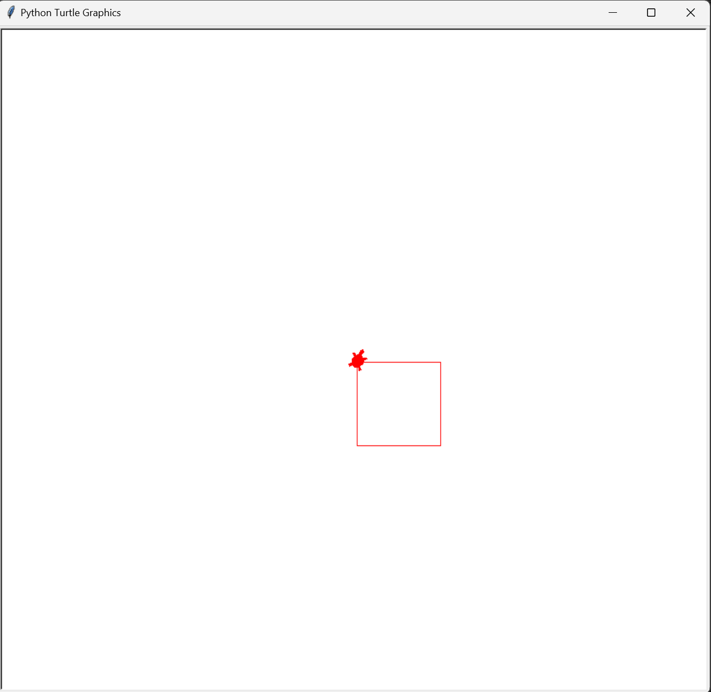
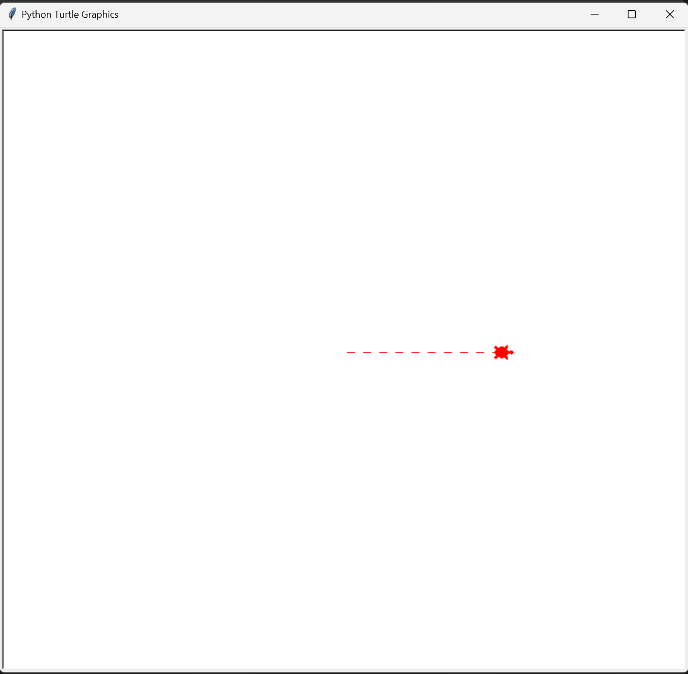
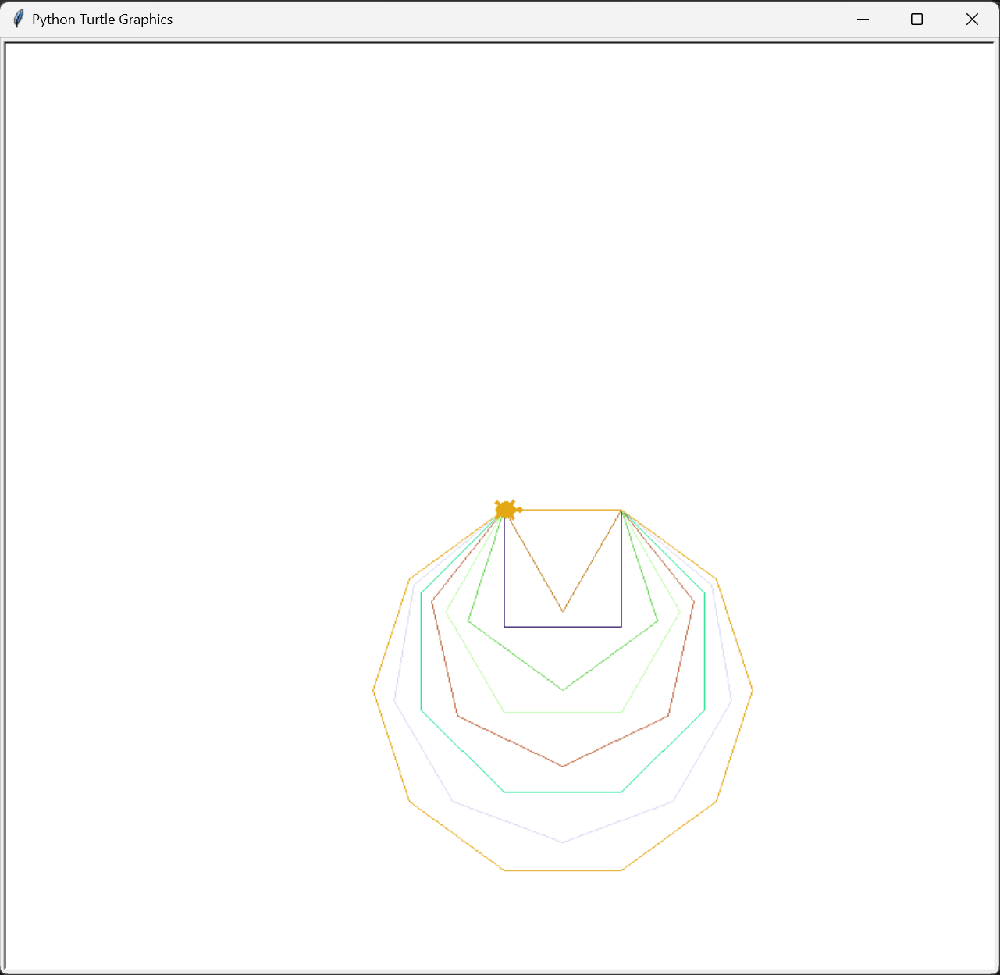
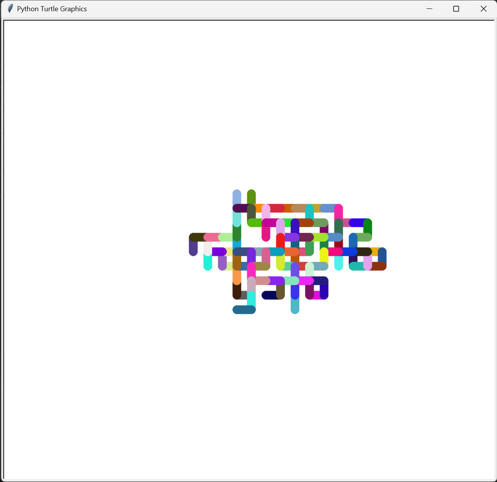
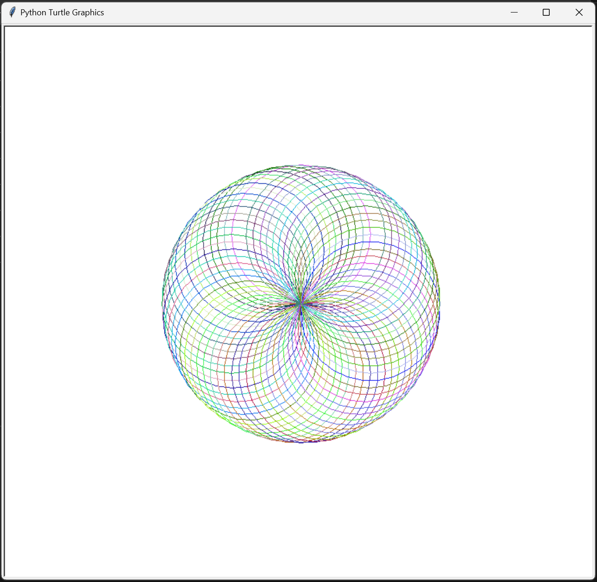
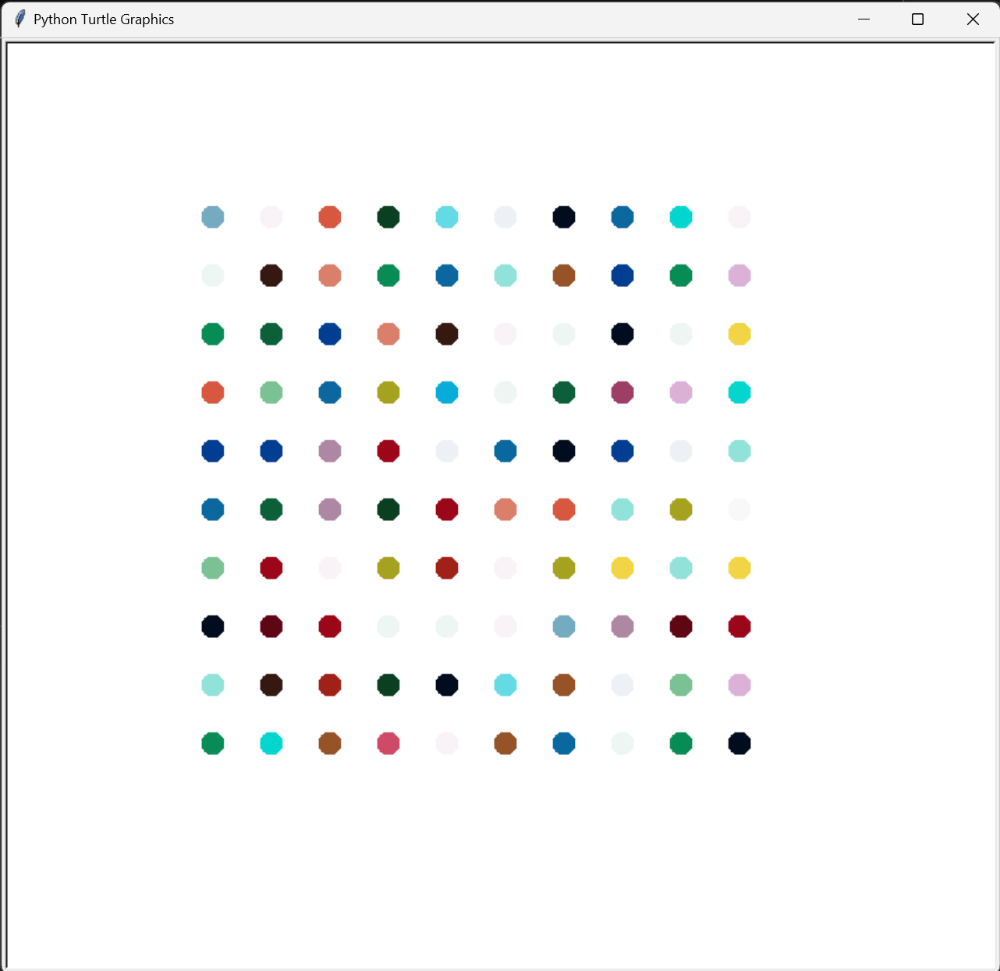

# Day 18: Turtle Graphics and Hirst Painting Project

## Overview

On Day 18, I explored the basics of GUI programming using the Turtle graphics library in Python. I also implemented a creative project inspired by the artist Damien Hirst, generating a digital painting with Turtle.


## Concepts Practiced

- **Turtle Graphics**: Gaining familiarity with Turtle commands for creating graphical patterns.
- **Randomization**: Using Python's `random` library to introduce variability in graphical designs.
- **Color Manipulation**: Extracting and using RGB color values to create aesthetically pleasing designs.
- **GUI Programming**: Understanding basic concepts of graphical user interfaces through the Turtle library.


## Projects and Files

### Turtle Graphics Challenges

These files contain small programs created using the Turtle graphics library to practice basic drawing concepts.

#### `01-turtle-challenge1.py`
- **Description**: This script draws a simple square using the Turtle library.
- **Features**:
  - The turtle moves forward and turns at 90-degree angles to complete a square.



#### `02-turtle-challenge2.py`
- **Description**: This script draws a dashed line.
- **Features**:
  - The turtle alternates between drawing and lifting the pen to create a dashed effect.



#### `03-turtle-challenge3.py`
- **Description**: This script draws multiple shapes with increasing numbers of sides.
- **Features**:
  - Draws shapes from a triangle (3 sides) to a decagon (10 sides).
  - Randomly changes the color of the turtle for each shape.



#### `04-turtle-challenge4.py`
- **Description**: This script creates a random walk effect where the turtle moves in random directions.
- **Features**:
  - The turtle changes direction randomly in increments of 90 degrees.
  - The pen color changes randomly at each step.
  - The pen size is set to 15 to create a bolder path.



#### `05-turtle-challenge5.py`
- **Description**: This script draws a spirograph, a series of overlapping circles that create a hypnotic pattern.
- **Features**:
  - The turtle draws circles in a loop, slightly changing the heading each time.
  - The pen color changes randomly for each circle.



### Hirst Painting Project

This project is inspired by Damien Hirst's famous spot paintings. It uses the Turtle library to generate a grid of colored dots based on a palette extracted from an image.



#### Project Structure:

- **`/hirst_painting/main.py`**:
  - **Description**: This is the main script that draws the Hirst-inspired painting using Turtle.
  - **Features**:
    - Uses a predefined list of RGB colors to create a grid of colored dots.
    - The turtle moves to a new line after completing each row of dots.

- **`/hirst_painting/support/Color_palette.jpeg`**:
  - **Description**: An image file used to extract the color palette for the painting.
  - **Purpose**: This image provides the source colors that are used in the painting.

- **`/hirst_painting/support/create_color_list.py`**:
  - **Description**: A utility script to extract RGB colors from an image using the `colorgram` library.
  - **Features**:
    - Extracts the top 30 colors from `Color_palette.jpeg` and prints them as a list of RGB tuples.
    - The extracted color list is then used in `main.py` to color the dots in the Hirst painting.

## How to Run the Hirst Painting Project

1. **Navigate to the project directory**:
    ```bash
    cd hirst_painting
    ```

2. **Run the main script**:
    ```bash
    python main.py
    ```

3. **View the generated painting**:
    - A window will open displaying the Hirst-inspired painting created by Turtle.
    - The program will automatically close when you click on the window.
