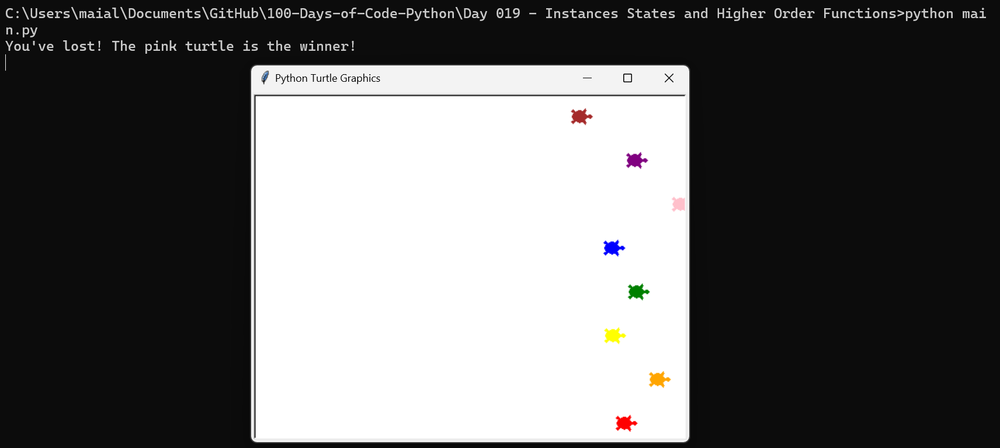

# Day 19: Instances, States, and Higher-Order Functions

## Overview

On Day 19, I delved deeper into Python's object-oriented programming by exploring instances, states, and higher-order functions. I applied these concepts through interactive projects using the Turtle graphics library.

## Concepts Practiced

- **Object-Oriented Programming**: Managing multiple instances of objects and their states.
- **Higher-Order Functions**: Implementing keyboard controls using higher-order functions to enhance interactivity.
- **User Interaction**: Integrating user input and providing feedback based on the outcomes of the simulation.

## Projects and Files

### Moving the Turtle Using Keyboard

This project demonstrates how to control a Turtle object using keyboard inputs. The script sets up keyboard bindings to move the Turtle in different directions and clear the screen.

#### `01-move-turtle-using-keyboard.py`
- **Description**: This script allows the user to control a Turtle using the arrow keys and reset the drawing with the 'C' key.
- **Key Features**:
  - **Move Forward**: Press the "Up" arrow key to move the turtle forward by 20 units.
  - **Move Backward**: Press the "Down" arrow key to move the turtle backward by 20 units.
  - **Turn Left**: Press the "Left" arrow key to rotate the turtle 90 degrees counterclockwise.
  - **Turn Right**: Press the "Right" arrow key to rotate the turtle 90 degrees clockwise.
  - **Clear Drawing**: Press the "C" key to clear the screen and reset the turtle's position to the center.
- **Concepts Practiced**:
  - **Higher-Order Functions**: `screen.onkey` is used to bind functions to specific key events, demonstrating the use of higher-order functions in Python.
  - **Turtle States**: Managing the state of the Turtle object, including its position and orientation.

### Turtle Race Game

This is a fun and interactive Turtle Race simulation where users can bet on which turtle will win. The script uses object-oriented programming to create and manage multiple turtle instances.



#### `main.py`
- **Description**: This script sets up a race between eight turtles, each with a unique color. The user can place a bet on which turtle will win, and the race is then simulated.
- **Key Features**:
  - **Turtle Creation**: The `create_turtle` function generates Turtle objects with distinct colors and positions them at the start line.
  - **User Interaction**: The user is prompted to place a bet on which turtle they think will win.
  - **Race Simulation**: The turtles move forward by random steps until one crosses the finish line.
  - **Outcome Display**: The script announces whether the user won or lost based on their bet.
- **Concepts Practiced**:
  - **Instances and States**: Managing multiple instances of the Turtle class, each with its own state (position and color).
  - **Randomization**: Using Python's `random` module to simulate the unpredictable nature of a race.
  - **User Input**: Collecting and processing user input through the Turtle screen's text input prompt.

## How to Run the Turtle Race Game

1. **Navigate to the project directory**

2. **Run the main script**:
    ```bash
    python main.py
    ```

3. **Place Your Bet**: A prompt will appear asking you to enter the color of the turtle you think will win the race.

4. **Watch the Race**: The turtles will race across the screen. The result will be displayed in the console after the race.

5. **Close the Screen**: Click on the Turtle graphics window to close the program.

