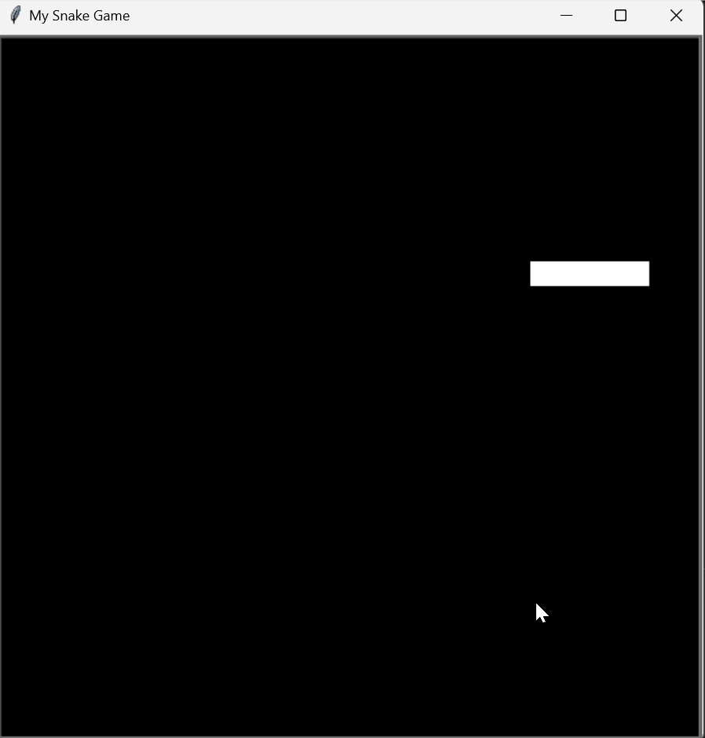

# Day 20: Snake Game (Part 1)

## Overview

On Day 20, I started developing the classic Snake Game using Python's Turtle graphics library. This is the first part of the project, where I implemented the basic snake movement and control mechanisms.

## Demo


## Project Files

### Snake Class Implementation

The `Snake` class handles the creation, movement, and direction control of the snake. It defines the core behavior needed to simulate the snake's movement across the screen.

#### `snake.py`
- **Description**: This file contains the implementation of the `Snake` class, which manages the snake's body, movement, and direction.
- **Key Features**:
  - **Snake Initialization**: The snake is created with a body composed of square segments (turtles) positioned horizontally.
  - **Movement Control**: The snake moves forward continuously, and the user can control its direction using the arrow keys.
  - **Follow Mechanism**: The segments of the snake follow the segment in front of them to create a smooth movement effect.
  - **Directional Controls**: The snake's movement direction can be altered by pressing the "Up", "Down", "Left", and "Right" keys, ensuring that it doesn't reverse onto itself.

- **Class Methods**:
  - `create_snake_dot()`: Creates each segment of the snake's body.
  - `folow_next_segment()`: Ensures each segment of the snake follows the one in front of it.
  - `move()`: Moves the snake forward by a predefined distance.
  - `up()`, `down()`, `left()`, `right()`: Changes the direction of the snake based on user input, preventing the snake from moving in the opposite direction.

### Main Game Setup

The `main.py` file is where the game setup, main loop, and user interactions are handled.

#### `main.py`
- **Description**: This file sets up the game window, initializes the `Snake` object, and manages the game loop.
- **Key Features**:
  - **Screen Setup**: Initializes a 600x600 pixel game window with a black background.
  - **Game Loop**: Continuously updates the screen to animate the snake's movement, with a slight delay to control the speed.
  - **User Input**: Listens for keyboard input to change the snake's direction.
  - **Game State**: Runs the game loop as long as `game_is_on` is `True`.

## How to Run the Snake Game

1. **Navigate to the project directory**

2. **Run the main script**:
    ```bash
    python main.py
    ```

3. **Control the Snake**:
    - Use the arrow keys to change the direction of the snake:
      - **Up Arrow**: Move the snake up.
      - **Down Arrow**: Move the snake down.
      - **Left Arrow**: Move the snake left.
      - **Right Arrow**: Move the snake right.

4. **End the Game**:
    - The game will continue to run until you manually close the Turtle graphics window.

## Concepts Practiced

- **Object-Oriented Programming**: Implementing a class to manage the state and behavior of the snake.
- **Event Handling**: Using keyboard events to control the snake's movement.
- **Animation Control**: Managing the Turtle graphics animation speed and screen updates to create a smooth gaming experience.

## Next Steps

In the next part of the Snake Game project, I'll add functionality to detect collisions, manage the game over state, and implement a scoring system.
