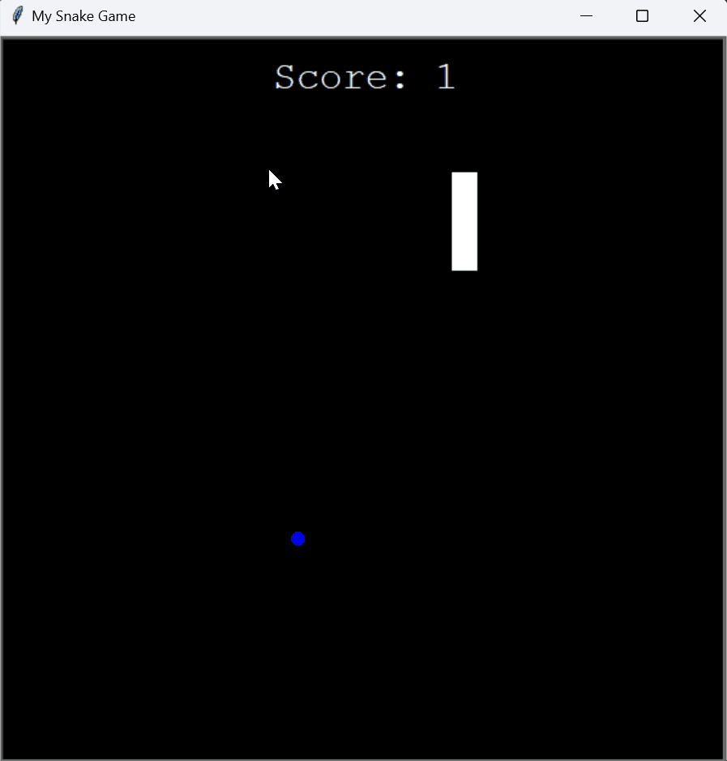

# Day 21: Inheritance & Snake Game (Part 2)

## Overview

On Day 21, I learned about object-oriented inheritance and completed the second part of the Snake Game project. This involved adding more complexity to the Snake Game by incorporating food, scoring, and collision detection. Additionally, I explored inheritance in Python through a simple example.

## Project Files

### Snake Game (Part 2)

In this part of the project, I extended the Snake Game by adding new features such as food, a scoreboard, and collision detection. The game now includes a fully functional gameplay loop where the snake grows when it eats food, and the game ends if the snake collides with the wall or its tail.

#### Demo


#### `snake.py`
- **Description**: This file contains the `Snake` class, which handles the snake's movement, direction control, and growth.
- **Key Features**:
  - **Snake Movement**: The snake moves forward and can change direction based on user input.
  - **Extend Snake**: When the snake eats food, it grows longer by adding a new segment to its body.
  - **Collision Detection**: The class includes logic to detect collisions with the wall and the snake's own body.

#### `food.py`
- **Description**: This file contains the `Food` class, responsible for creating food for the snake to eat.
- **Key Features**:
  - **Random Positioning**: The food is randomly positioned on the screen each time it is eaten by the snake.
  - **Fast Movement**: The food is represented as a blue circle that appears instantly in a new location.

#### `scoreboard.py`
- **Description**: This file contains the `Scoreboard` class, which manages the player's score and displays it on the screen.
- **Key Features**:
  - **Score Tracking**: The class increments the score each time the snake eats food.
  - **Game Over Display**: When the game ends, a "GAME OVER" message is displayed at the center of the screen.

#### `main.py`
- **Description**: This file is the entry point for the Snake Game. It initializes the game, sets up the screen, and contains the game loop.
- **Key Features**:
  - **Game Loop**: Continuously updates the game, checks for collisions, and manages the snake's movement and growth.
  - **User Input**: Listens for arrow key presses to control the snake's direction.

### Inheritance Example

To understand inheritance in Python, I created a simple example demonstrating how a subclass can inherit properties and methods from a parent class.

#### `/inheritance-example/inheritance-example.py`
- **Description**: This file contains a basic example of inheritance using an `Animal` class and a `Fish` subclass.
- **Key Concepts**:
  - **Inheritance**: The `Fish` class inherits attributes and methods from the `Animal` class.
  - **Method Overriding**: The `Fish` class overrides the `breathe` method to include additional behavior.
  - **Class Instances**: An instance of the `Fish` class is created, demonstrating how it can access both inherited and overridden methods.

- **Classes**:
  - `Animal`: A base class with a `num_eyes` attribute and a `breathe` method.
  - `Fish`: A subclass that inherits from `Animal`, adds a `swim` method, and overrides the `breathe` method.

## How to Run the Snake Game

1. **Navigate to the project directory**

2. **Run the main script**:
    ```bash
    python main.py
    ```

3. **Control the Snake**:
    - Use the arrow keys to change the direction of the snake:
      - **Up Arrow**: Move the snake up.
      - **Down Arrow**: Move the snake down.
      - **Left Arrow**: Move the snake left.
      - **Right Arrow**: Move the snake right.

4. **Gameplay**:
    - The snake grows longer when it eats the food.
    - The game ends if the snake collides with the wall or its own tail.

## Concepts Practiced

- **Inheritance**: Understanding how subclasses inherit from and extend the functionality of parent classes.
- **Object-Oriented Programming**: Enhancing the Snake Game with additional classes (`Food`, `Scoreboard`) and more complex behavior.
- **Event Handling**: Implementing real-time collision detection and responding to game events such as eating food and game over.
