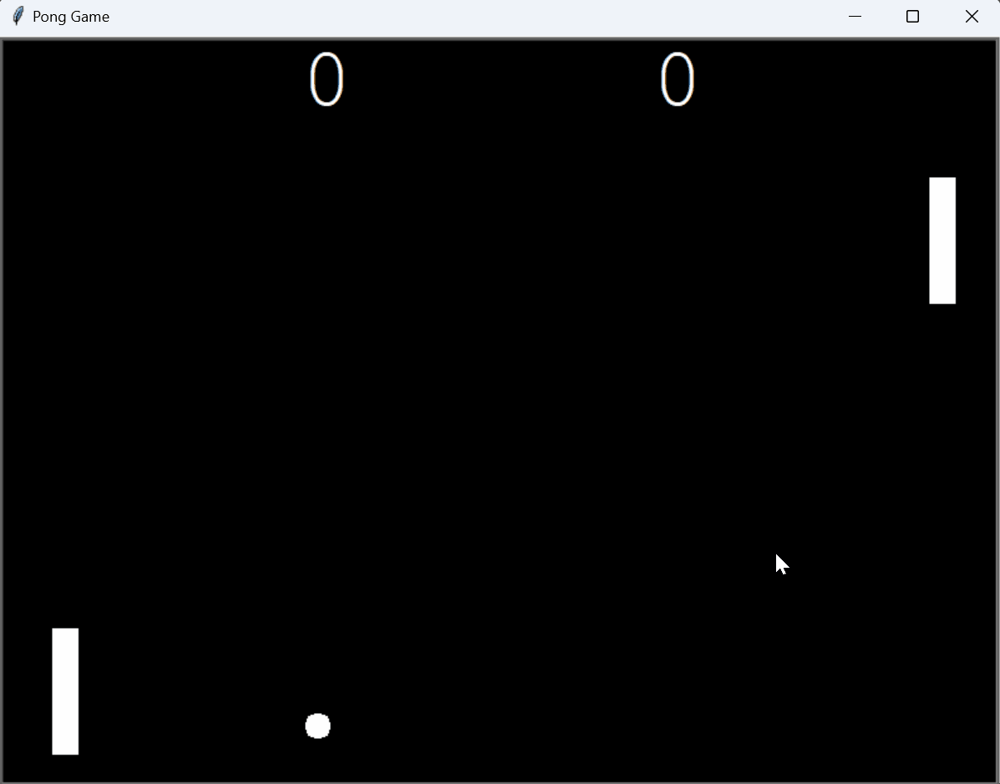

# Day 22: Pong Game

## Overview

On Day 22, I created a fully functional Pong Game using Python's `turtle` module. This classic game involves two paddles and a ball, where two players compete to hit the ball back and forth. The game implements scoring and dynamic ball movement, including collision detection and speed adjustments.

## Demo



## Project Files - Pong Game

The Pong Game consists of several key components: paddles, a ball, and a scoreboard. The game mechanics involve controlling the paddles with keyboard inputs, bouncing the ball off the walls and paddles, and tracking scores for both players.


### `ball.py`
- **Description**: This file contains the `Ball` class, which manages the ball's movement, collision behavior, and speed.
- **Key Features**:
  - **Movement**: The ball moves in a straight line, with its direction determined by the initial heading.
  - **Bouncing**: The ball can bounce off the walls (horizontal bounce) and paddles (vertical bounce).
  - **Speed Control**: The ball's speed increases slightly each time it hits a paddle, making the game progressively more challenging.
  - **Reset Functionality**: When the ball goes out of bounds, it resets to the center with its speed reset.

### `paddle.py`
- **Description**: This file contains the `Paddle` class, which allows players to control the paddles on the screen.
- **Key Features**:
  - **Up and Down Movement**: Paddles can move up and down based on keyboard input.
  - **Positioning**: The paddles are positioned at fixed x-coordinates, with movement restricted to the y-axis.

### `scoreboard.py`
- **Description**: This file contains the `Scoreboard` class, which displays the current score for both players.
- **Key Features**:
  - **Score Tracking**: The scoreboard keeps track of and displays the scores for the left and right players.
  - **Dynamic Display**: The scoreboard updates in real-time as players score points.

### `main.py`
- **Description**: This file is the entry point for the Pong Game. It sets up the game environment, initializes the paddles, ball, and scoreboard, and contains the game loop.
- **Key Features**:
  - **Game Setup**: Initializes the screen, paddles, ball, and scoreboard.
  - **Game Loop**: Continuously updates the game, handles collisions, and manages ball movement.
  - **User Input**: Maps the keyboard inputs to control the left and right paddles.

## How to Run the Pong Game

1. **Navigate to the project directory**

2. **Run the main script**:
    ```bash
    python main.py
    ```

3. **Control the Paddles**:
    - **Right Paddle**:
      - **Up Arrow**: Move the right paddle up.
      - **Down Arrow**: Move the right paddle down.
    - **Left Paddle**:
      - **W Key**: Move the left paddle up.
      - **S Key**: Move the left paddle down.

4. **Gameplay**:
    - The ball starts moving at an initial speed.
    - The ball bounces off the paddles and the top and bottom walls.
    - When the ball goes out of bounds on the right side, the left player scores a point.
    - When the ball goes out of bounds on the left side, the right player scores a point.
    - The game continues until manually closed.

## Concepts Practiced

- **Object-Oriented Programming**: Structured the game using classes (`Ball`, `Paddle`, `Scoreboard`), encapsulating the game logic within these objects.
- **Event Handling**: Implemented keyboard controls to move the paddles.
- **Collision Detection**: Managed ball collisions with paddles and walls to create the bouncing effect.
- **Game Loop Management**: Controlled the speed and flow of the game using a continuous loop and time delays.
