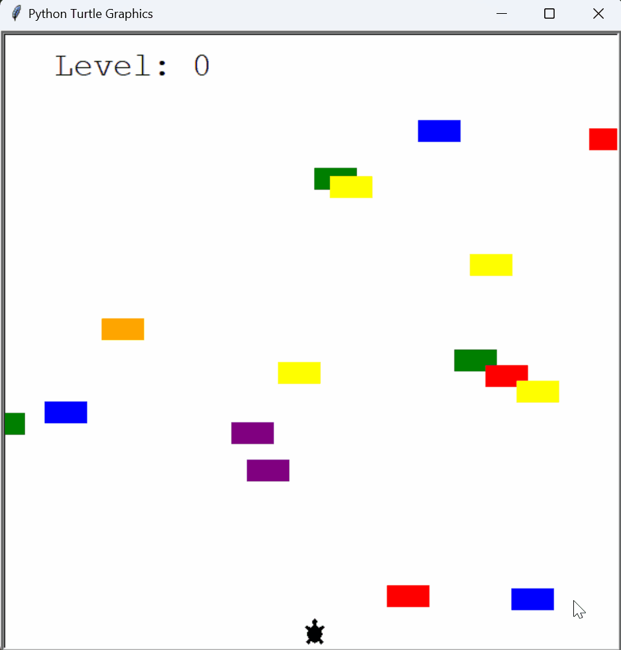

# Day 23: Turtle Crossing Game

## Overview

On Day 23, I developed a Turtle Crossing Game using Python's `turtle` module. In this game, the player controls a turtle trying to cross a busy road filled with moving cars. The objective is to reach the other side without getting hit by any cars. Each successful crossing increases the level, making the cars move faster and adding to the challenge.

## Demo


## Project Files - Turtle Crossing Game

The Turtle Crossing Game consists of several components: the player (turtle), moving cars, and a scoreboard to track the player's progress. The game involves simple controls and features increasing difficulty as the player progresses.


### `car_manager.py`
- **Description**: This file manages the creation and movement of cars on the screen.
- **Key Features**:
  - **Car Creation**: Cars are randomly generated at different y-coordinates.
  - **Car Movement**: All cars move horizontally across the screen from right to left.
  - **Speed Control**: As the player levels up, the cars move faster, increasing the game's difficulty.

### `car.py`
- **Description**: This file defines the `Car` class, which represents individual cars in the game.
- **Key Features**:
  - **Appearance**: Each car is a colored rectangle that moves horizontally.
  - **Randomization**: Cars are assigned random colors and y-positions on creation.

### `main.py`
- **Description**: This file is the entry point for the Turtle Crossing Game. It sets up the game environment, initializes the player, car manager, and scoreboard, and contains the game loop.
- **Key Features**:
  - **Game Setup**: Initializes the screen, player, car manager, and scoreboard.
  - **Game Loop**: Continuously updates the game, checks for collisions, and manages player progression.
  - **User Input**: Maps the keyboard input to control the turtle's movement.

### `player.py`
- **Description**: This file contains the `Player` class, which manages the turtle's movement and position.
- **Key Features**:
  - **Movement**: The turtle moves upward in response to the player pressing the "Up" arrow key.
  - **Reset Position**: After reaching the top of the screen, the turtle returns to the starting position to attempt another crossing.

### `scoreboard.py`
- **Description**: This file defines the `Scoreboard` class, which displays the current level and shows a "Game Over" message if the player collides with a car.
- **Key Features**:
  - **Level Tracking**: The scoreboard tracks and displays the current level.
  - **Game Over**: When the player is hit by a car, the game ends and a "Game Over" message is displayed.

## How to Run the Turtle Crossing Game

1. **Navigate to the project directory**

2. **Run the main script**:
    ```bash
    python main.py
    ```

3. **Control the Turtle**:
    - **Up Arrow**: Move the turtle forward.

4. **Gameplay**:
    - The turtle starts at the bottom of the screen and moves upward to cross the road.
    - Cars move horizontally from the right to the left side of the screen.
    - Avoid the cars and reach the top of the screen to level up.
    - Each level increases the speed of the cars, making the game more challenging.
    - The game ends when the turtle collides with a car.

## Concepts Practiced

- **Object-Oriented Programming**: Structured the game using classes (`Player`, `Car`, `CarManager`, `Scoreboard`), encapsulating the game logic within these objects.
- **Event Handling**: Implemented keyboard controls to move the turtle.
- **Collision Detection**: Managed car collisions with the turtle to determine game outcomes.
- **Game Loop Management**: Controlled the game flow using a continuous loop and time delays, with dynamic difficulty adjustments.
