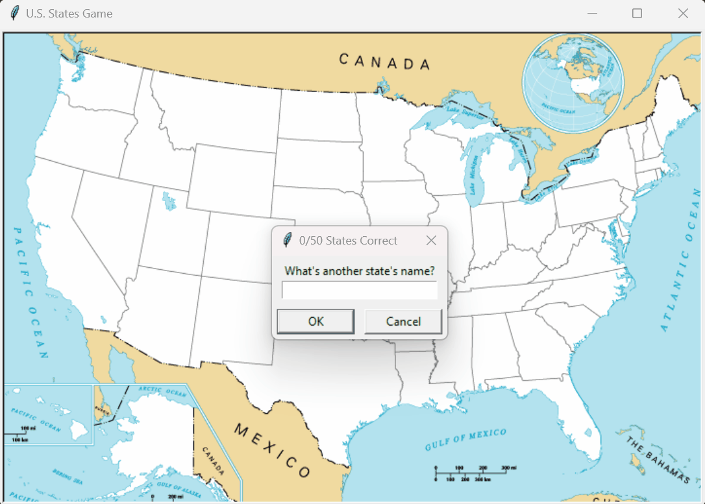

# Day 25: Working with CSV Files and Pandas Library

Welcome to Day 25 of learning Python! Today, we explored how to work with CSV files and the powerful Pandas library. This folder contains two projects: general usage of CSV files with Pandas and a U.S. States Game that tests knowledge of U.S. geography.

## Concepts Learned

- **Reading CSV Files**: Learned how to read CSV files using both the `csv` module and Pandas.
- **DataFrames and Series**: Explored Pandas DataFrames and Series, understanding how to manipulate and analyze data within these structures.
- **Writing to CSV Files**: Gained experience in writing data to CSV files, both from lists and DataFrames.
- **Basic Data Analysis**: Performed simple data analysis using Pandas, such as calculating averages, finding maximum values, and counting occurrences of values.
- **Building a Game with Data**: Developed a simple interactive game that integrates data from a CSV file with visual feedback using the Turtle graphics library.

## Folder Structure

Here’s an overview of the files created during this session:

```
general_usage/
├── 2018_Central_Park_Squirrel_Census_-_Squirrel_Data.csv
├── count.csv
├── main.py
├── new_data.csv
├── weather_data.csv
US_States_Game/
├── 50_states.csv
├── blank_states_img.gif
├── main.py
└── missing_states.csv
```

### General Usage

This project demonstrates how to read, process, and write CSV files using both the `csv` module and the Pandas library.

- **`2018_Central_Park_Squirrel_Census_-_Squirrel_Data.csv`**: Contains data from the Central Park Squirrel Census. We used this data to count the number of squirrels based on their primary fur color.
- **`count.csv`**: The output file that contains the count of squirrels by their primary fur color.
- **`main.py`**: A script demonstrating various ways to read and manipulate CSV files using Python. This script includes:
  - Reading CSV files using the `csv` module.
  - Using Pandas to read and process data, convert it to different formats, and perform simple data analysis.
  - Creating new CSV files based on manipulated data.
- **`new_data.csv`**: A CSV file created from a dictionary of student names and their scores.
- **`weather_data.csv`**: A CSV file used to demonstrate basic Pandas operations, such as calculating the average temperature and finding the maximum temperature.

### U.S. States Game

This project is a simple game that helps you learn the U.S. states by guessing their names and locating them on a map.

#### Demo


#### Files:

- **`50_states.csv`**: Contains the names of U.S. states and their corresponding coordinates for placing on the map.
- **`blank_states_img.gif`**: The background image of the U.S. map used in the game.
- **`main.py`**: The main script for the U.S. States Game. It prompts the user to guess the names of U.S. states and places the correct guesses on the map. If the user exits the game before guessing all the states, the names of the missing states are saved in a CSV file.
- **`missing_states.csv`**: A CSV file generated by the game, listing the states that were not guessed by the user.


## How to Run

1. **General Usage Scripts**:
   - Run `main.py` in the `general_usage` folder to see different examples of CSV file manipulation and Pandas usage.
   - Ensure the required CSV files are in the same directory as `main.py`.

2. **U.S. States Game**:
   - Run `main.py` in the `US_States_Game` folder.
   - The game will open a window where you can guess U.S. states. Type the state names in the prompt and see them appear on the map.

