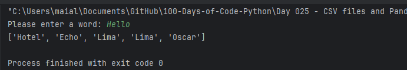

# Day 26: List Comprehension and NATO Alphabet Project

Welcome to Day 26 of learning Python! Today, we focused on mastering list comprehension and dictionary comprehension, powerful techniques for creating and manipulating lists and dictionaries. Additionally, we developed a project to convert words into their corresponding NATO phonetic alphabet codes.

## Concepts Learned

- **List Comprehension**: A concise way to create lists by applying an expression to each item in an iterable.
- **Dictionary Comprehension**: A method to create dictionaries from an iterable, with optional conditions.
- **Working with Files**: Reading from text files and extracting data to compare lists.
- **Iterating DataFrames**: Efficiently iterating over rows in a Pandas DataFrame.
- **NATO Phonetic Alphabet**: Translating user input into the NATO phonetic alphabet using a CSV file and Python dictionaries.

## Folder Structure

Here’s an overview of the files created during this session:

```
List_and_Dictionary_Comprehension/
├── file1.txt
├── file2.txt
├── main.py
NATO_Alphabet/
├── main.py
└── nato_phonetic_alphabet.csv
```

### List and Dictionary Comprehension

This project demonstrates the usage of list and dictionary comprehensions to efficiently process data.

- **`file1.txt`** & **`file2.txt`**: These text files contain lists of numbers. We use them in a script to find common numbers between the two files using list comprehension.
- **`main.py`**: The script contains several examples of list and dictionary comprehensions, illustrating different ways to create and filter lists and dictionaries. Key topics covered include:
  - Basic list comprehension for transforming lists.
  - Conditional list comprehension for filtering lists.
  - Creating dictionaries with dictionary comprehension.
  - Iterating over Pandas DataFrames using `.iterrows()`.

#### Key Concepts in `main.py`:

1. **List Comprehension**:
    - Creating lists with expressions.
    - Filtering lists with conditions.
    - Transforming strings and ranges into lists.

2. **Dictionary Comprehension**:
    - Constructing dictionaries from lists.
    - Filtering items in a dictionary based on conditions.
    - Practical examples, such as converting temperatures from Celsius to Fahrenheit.

3. **Iterating over DataFrames**:
    - Demonstrating how to iterate over a DataFrame using Pandas’ `.iterrows()` method.

### NATO Alphabet Project

This project translates a user-inputted word into its corresponding NATO phonetic alphabet codes. Execution example:



- **`nato_phonetic_alphabet.csv`**: Contains the NATO phonetic alphabet with letters and their corresponding code words (e.g., A -> Alfa, B -> Bravo).
- **`main.py`**: The script reads the CSV file and converts the data into a dictionary. It then prompts the user for a word and outputs the corresponding phonetic code words using list comprehension.

#### Key Steps in `main.py`:

1. **Reading the CSV**:
    - The script uses Pandas to read `nato_phonetic_alphabet.csv` into a DataFrame.
    - The DataFrame is converted into a dictionary for easy lookup.

2. **User Interaction**:
    - The user is prompted to enter a word.
    - The script then converts the word into its NATO phonetic alphabet representation using list comprehension and outputs the result.


## How to Run

1. **List and Dictionary Comprehension**:
   - Run `main.py` in the `List_and_Dictionary_Comprehension` folder to see various examples of list and dictionary comprehensions in action.
   - Ensure `file1.txt` and `file2.txt` are present in the same directory to correctly execute the script's file reading section.

2. **NATO Alphabet Project**:
   - Run `main.py` in the `NATO_Alphabet` folder.
   - Enter a word when prompted, and the script will output the word's corresponding NATO phonetic alphabet codes.
