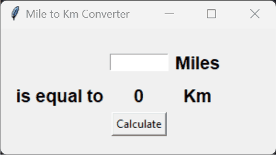

# Day 27: Introduction to Tkinter and Default Arguments

Welcome to Day 27 of learning Python! Today's focus was on getting hands-on experience with the Tkinter library for creating graphical user interfaces (GUIs) and understanding the use of default arguments in functions. Additionally, we built a simple project to convert miles to kilometers.

## Concepts Learned

- **Tkinter Basics**: Introduction to creating simple GUIs in Python using Tkinter.
- **Default Arguments**: Understanding and using `*args` and `**kwargs` to handle variable numbers of arguments in functions.
- **GUI Design**: Designing a user-friendly interface for converting miles to kilometers.
- **Event Handling**: Responding to user interactions like button clicks and input changes.


## Folder Structure

Here’s an overview of the files created during this session:

```
general_usage/
├── main.py
├── playground.py
└── tkinter_library_playground.py
miles_to_km/
└── main.py
```

### General Usage

This section includes scripts exploring the basics of Tkinter and the use of `*args` and `**kwargs` in functions.

- **`main.py`**: This script demonstrates the creation of a simple GUI using Tkinter, including labels, buttons, and entry fields. It showcases how to handle user input and update the GUI dynamically.
  
- **`playground.py`**: A playground script for experimenting with positional (`*args`) and keyword arguments (`**kwargs`). The script illustrates:
  - How to sum an arbitrary number of arguments using `*args`.
  - How to manipulate keyword arguments using `**kwargs`.
  - Creation of a class (`Car`) that can accept dynamic attributes using `**kwargs`.

- **`tkinter_library_playground.py`**: A comprehensive script that explores various Tkinter widgets and functionalities:
  - **Label**: Displaying and updating text.
  - **Entry**: Capturing user input.
  - **Button**: Triggering actions on click.
  - **Text**: Handling multi-line text input.
  - **Spinbox**: Selecting a value from a range.
  - **Scale**: Sliding to select a value within a range.
  - **Checkbutton**: Toggling a boolean option.
  - **Radiobutton**: Selecting one option from multiple choices.
  - **Listbox**: Selecting an item from a list.

### Miles to Km Converter Project

This project demonstrates how to build a simple GUI application using Tkinter to convert miles to kilometers.



- **`main.py`**: The main script for the miles to kilometers converter project. It creates a user-friendly interface where the user can input a value in miles and get the corresponding value in kilometers. Key components include:
  - **Labels**: Used to display text like "Miles", "Km", and "is equal to".
  - **Entry**: A field where the user enters the number of miles.
  - **Button**: A "Calculate" button that triggers the conversion.
  - **Result Display**: A label that dynamically updates with the conversion result when the user clicks the "Calculate" button.

#### Key Concepts in `main.py`:

1. **Tkinter Basics**:
   - Setting up a Tkinter window with `Tk()`.
   - Using the `Label`, `Entry`, and `Button` widgets.
   - Layout management with the `grid` method.
   - Event handling and updating the GUI dynamically.

2. **Conversion Logic**:
   - Simple arithmetic for converting miles to kilometers.
   - Rounding the result for simplicity.

## How to Run

1. **General Tkinter Playground**:
   - Navigate to the `general_usage` directory.
   - Run `main.py` to see a basic GUI with interactive elements.
   - Use `playground.py` to experiment with `*args` and `**kwargs`.
   - Run `tkinter_library_playground.py` to explore various Tkinter widgets and their functionality.

2. **Miles to Km Converter**:
   - Navigate to the `miles_to_km` directory.
   - Run `main.py` to launch the miles to kilometers converter GUI.
   - Input a value in miles, click "Calculate", and see the result displayed in kilometers.

