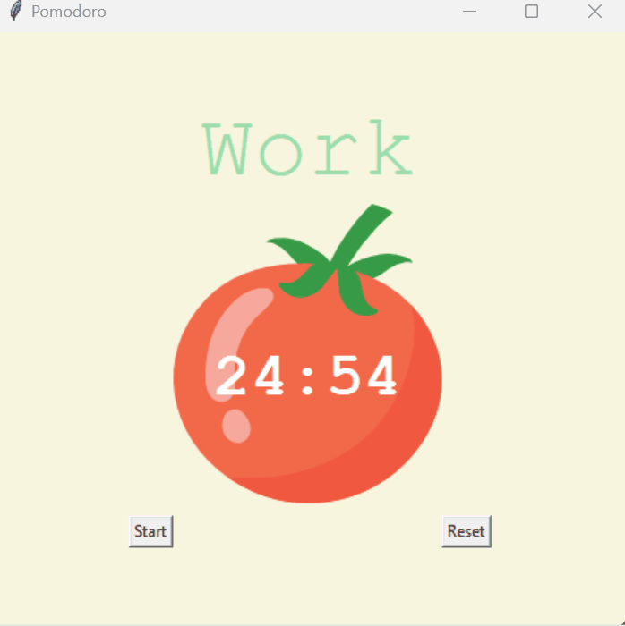

# Day 28: Building a Pomodoro Timer with Tkinter

Welcome to Day 28 of learning Python! Today’s focus was on creating a functional Pomodoro timer application using Tkinter, a standard GUI library in Python. This project not only reinforces the understanding of Tkinter but also introduces to dynamic typing and time management concepts.


## Learning Outcomes

- **Tkinter Mastery**: Gained hands-on experience with Tkinter, reinforcing concepts like canvas drawing, widget management, and event handling.
- **Dynamic Typing**: Applied Python's dynamic typing to manage session states and UI updates efficiently.
- **Time Management Techniques**: Implemented the Pomodoro Technique, a popular productivity method, as a Python project.


## Demo


## Folder Structure 

**Files Overview**

- **`main.py`**: This is the main script that builds and runs the Pomodoro timer application. It includes the logic for starting, resetting, and counting down the timer, as well as updating the user interface dynamically.

- **`tomato.png`**: An image of a tomato used as the central visual element in the Pomodoro timer GUI, symbolizing the Pomodoro Technique.

## Pomodoro Timer Overview

The Pomodoro Technique is a time management method where you work for a set amount of time (usually 25 minutes), followed by a short break. After completing several work sessions, you take a longer break. This application automates this process using a simple and intuitive interface.

### Key Features

- **Timer Setup**:
  - **Work Session**: 25 minutes
  - **Short Break**: 5 minutes
  - **Long Break**: 20 minutes

- **Dynamic Typing**:
  - Using dynamic typing in Python to handle the timer functionality and UI updates.

- **Graphical Interface**:
  - Created using Tkinter, with a tomato image representing the Pomodoro and text displaying the countdown timer.
  - **Start** and **Reset** buttons to control the timer.
  - A label that shows checkmarks (✓) to represent completed work sessions.

### How to Run the Project

1. **Setup**:
   - Ensure Python is installed on your system.
   - The project uses Tkinter, which is included in standard Python distributions.

2. **Running the Application**:
   - Simply run the `main.py` script:
     ```
     python main.py
     ```
   - The Pomodoro timer GUI will appear, with the tomato image and a "00:00" timer display.

3. **Using the Timer**:
   - **Start Button**: Begins the countdown for a work session or break.
   - **Reset Button**: Stops the current timer and resets all elements (timer, session counter, and checkmarks).

### Code Breakdown

- **Constants**:
  - Defined color codes, font styles, and session durations to maintain consistency across the application.

- **UI Setup**:
  - The user interface is built using Tkinter widgets, including `Label`, `Button`, and `Canvas`.
  - The tomato image is loaded and displayed on the canvas, with the countdown timer text overlayed.

- **Timer Mechanism**:
  - **`start_timer()`**: Determines the session type (work or break) based on the number of sessions (`reps`) completed and initiates the countdown.
  - **`count_down(count)`**: Handles the countdown mechanism, updating the timer display every second.

- **Reset Functionality**:
  - **`reset_timer()`**: Stops the current timer and resets all display elements to their initial state.

