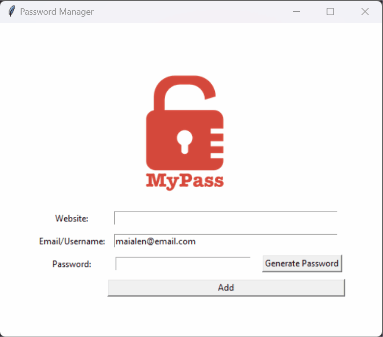

# Day 29: Building a Password Manager with Tkinter

Welcome to Day 29 of learning Python! In this project, I created a Password Manager application using Tkinter. This project combines GUI programming with file handling to manage and store passwords securely.

## Learning Outcomes

- **Tkinter Mastery**: Further practice with Tkinter for GUI design, focusing on layout management and user interaction.
- **File Handling**: Reinforced understanding of file operations by reading and writing data securely.
- **Password Security**: Learned how to generate strong passwords programmatically and manage them effectively.


## Demo


## Folder Structure

**Files Overview**

- **`main.py`**: The main Python script that implements the Password Manager application. It includes functions to generate secure passwords, save credentials, and create a user-friendly interface.
- **`logo.png`**: The logo image displayed in the application’s user interface.
- **`data.txt`**: A text file where the stored passwords and associated details are saved.

## Password Manager Overview

This Password Manager allows you to generate and save passwords securely. The application provides a simple GUI to enter website details, generate strong passwords, and store them in a text file for future reference.

### Key Features

- **Password Generation**:
  - Generates a secure password using a combination of letters, numbers, and symbols.
  - Automatically copies the generated password to the clipboard for easy pasting.

- **Data Storage**:
  - Saves website details, usernames, and passwords in a text file (`data.txt`) for easy retrieval.
  - Ensures that no fields are left empty before saving the credentials.

- **Graphical Interface**:
  - Built using Tkinter, providing an intuitive and easy-to-use interface.
  - Includes entry fields for the website, username/email, and password, along with buttons to generate and save passwords.

### How to Run the Project

1. **Setup**:
   - Ensure Python is installed on your system.
   - Install the `pyperclip` module using `pip` if it's not already installed:
     ```
     pip install pyperclip
     ```

2. **Running the Application**:
   - Run the `main.py` script:
     ```
     python main.py
     ```
   - The Password Manager GUI will appear, allowing you to manage your passwords.

3. **Using the Password Manager**:
   - **Website**: Enter the name of the website.
   - **Email/Username**: Enter your email or username associated with the website.
   - **Password**: Generate a strong password using the "Generate Password" button or enter one manually.
   - **Add Button**: Save the entered credentials to `data.txt`.

4. **Saving Credentials**:
   - Credentials are saved in the `data.txt` file in the format:
     ```
     website | username | password
     ```
   - Example entries in `data.txt`:
     ```
     fb | maialen@email.com | 123
     amazon | maialen@email.com | 123
     ```

### Code Breakdown

- **Password Generator**:
  - **`generate_password()`**: This function creates a random password by combining letters, numbers, and symbols. The password is then copied to the clipboard for easy use.

- **Saving Data**:
  - **`save()`**: This function retrieves the data from the input fields, validates them, and then writes the details to `data.txt`. It also clears the input fields after saving.

- **UI Setup**:
  - The user interface is built using Tkinter widgets such as `Label`, `Entry`, `Button`, and `Canvas`.
  - The `logo.png` image is displayed at the top of the application window for a more professional look.

