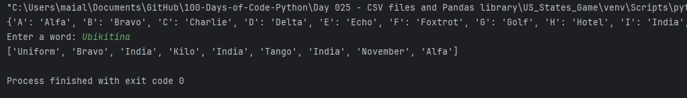
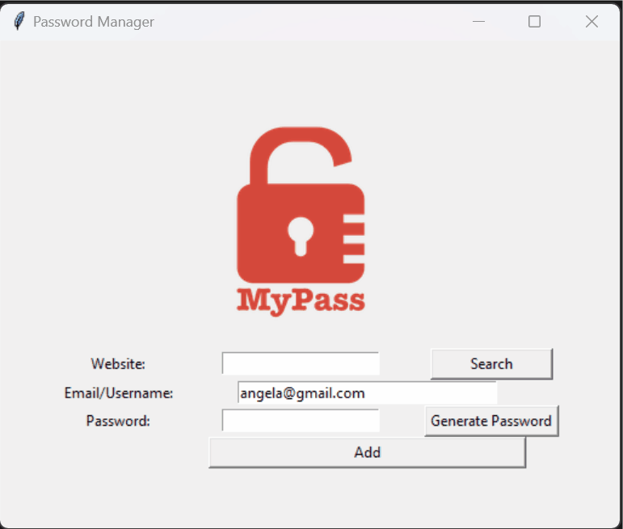

# Day 30: Errors, Exceptions, and JSON Data

## Overview
On Day 30 of learning Python, I focused on handling errors and exceptions, as well as working with JSON data. I applied these concepts to enhance two previous projects: the NATO Phonetic Alphabet converter and the Password Manager. Below are the details of the files created and the improvements made.

## Demo

### NATO Phonetic Alphabet with Exceptions

### Password Manager with JSON and Exceptions

## Key Concepts Learned
- **Error and Exception Handling:**
  - How to use `try`, `except`, `else`, and `finally` blocks to handle errors gracefully.
  - Creating custom error messages using `raise`.
  - The importance of managing exceptions to prevent program crashes and improve user experience.

- **Working with JSON:**
  - Reading from and writing to JSON files using the `json` module.
  - Updating existing JSON data and handling scenarios where the file might not exist.
  - Using JSON to store structured data, which makes it easier to manage and retrieve information.

## Files and Projects

### Error Handling Practice
- **Files:**
  - `main.py`
  - `a_file.txt`

- **Description:**
  - This script contains various examples of handling common Python exceptions including `FileNotFoundError`, `KeyError`, `IndexError`, and `TypeError`.
  - It demonstrates the use of `try`, `except`, `else`, and `finally` blocks to manage errors and ensure program stability.
  - Example scenarios include:
    - Opening a non-existent file.
    - Accessing a non-existent key in a dictionary.
    - Indexing out of range in a list.
    - Performing operations with incompatible types.

### NATO Phonetic Alphabet with Exceptions
- **Files:**
  - `\NATO_Phonetic_Alphabet_and_Exceptions\main.py`
  - `\NATO_Phonetic_Alphabet_and_Exceptions\nato_phonetic_alphabet.csv`

- **Description:**
  - Enhanced the NATO Phonetic Alphabet project by adding error handling.
  - The script reads from a CSV file (`nato_phonetic_alphabet.csv`) to create a dictionary mapping letters to phonetic code words.
  - It includes error handling to ensure that the user only inputs alphabetic characters, and prompts for correct input if non-alphabetic characters are entered.
  - The program is designed to be robust, ensuring a seamless user experience even with incorrect inputs.

### Password Manager with JSON and Exceptions
- **Files:**
  - `\Password_Manager_and_Exceptions\data.json`
  - `\Password_Manager_and_Exceptions\logo.png`
  - `\Password_Manager_and_Exceptions\main.py`

- **Description:**
  - Improved the Password Manager by introducing JSON data handling and error management.
  - Passwords are now stored securely in a JSON file (`data.json`), which allows for easy storage, retrieval, and updating of data.
  - The script handles various potential issues, such as missing files (`FileNotFoundError`) and ensures that the user cannot leave fields empty before saving.
  - Key functionalities include:
    - **Password Generation:** Creates a secure password with a mix of letters, numbers, and symbols.
    - **Save Password:** Saves the website, email, and password into the JSON file.
    - **Find Password:** Searches the JSON file for stored credentials and displays them to the user.
    - **User Interface:** Utilizes `Tkinter` to provide a simple GUI for managing passwords.

## Running the Code

1. **Error Handling Practice:**
   - Run `main.py` to see different examples of exception handling.

2. **NATO Phonetic Alphabet with Exceptions:**
   - Navigate to the `\NATO_Phonetic_Alphabet_and_Exceptions` directory.
   - Run `main.py` and input a word to see its phonetic code representation. The program will handle non-alphabetic input gracefully.

3. **Password Manager with JSON and Exceptions:**
   - Navigate to the `\Password_Manager_and_Exceptions` directory.
   - Run `main.py` to open the Password Manager GUI. You can generate passwords, save them, and search for existing credentials stored in `data.json`.
