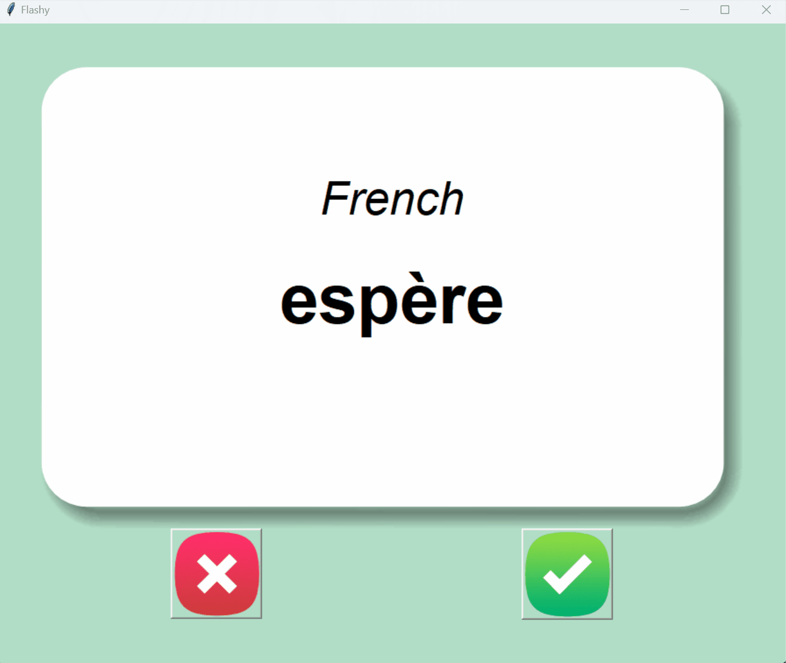

# Day 31: Flash Card App to Learn French

## Overview
On Day 31 of learning Python, I built a Flash Card application to help users learn French vocabulary. The app displays a French word on a flashcard, then flips to reveal its English translation after a few seconds. Users can mark whether they got the word correct or incorrect, and the app will keep track of words to review later.

## Demo



## Files and Structure

### Project Structure
```
📁 Flash Card App
├── 📄 main.py
├── 📁 data
│   ├── 📄 french_words.csv
│   └── 📄 words_to_learn.csv
└── 📁 images
    ├── 📄 card_back.png
    ├── 📄 card_front.png
    ├── 📄 right.png
    └── 📄 wrong.png
```

### `main.py`
- **Description:**
  - The main script that runs the Flash Card app using `tkinter` for the GUI and `pandas` for handling CSV data.
  - The app begins by attempting to load any words the user needs to learn from `words_to_learn.csv`. If this file doesn’t exist (e.g., on the first run), it loads the original vocabulary from `french_words.csv`.
  - The app displays a flashcard with a French word, and flips to reveal the English translation after a few seconds.
  - Users can indicate whether they knew the word or not using buttons. If they knew the word, it’s removed from the review list; otherwise, it remains for future practice.

- **Key Functions:**
  - `remove_card_and_show_next()`: Removes the current flashcard from the list of words to learn and saves the updated list.
  - `next_card()`: Displays the next French word on the flashcard.
  - `flip_card()`: Flips the flashcard to reveal the English translation.

### `\data\french_words.csv`
- **Description:**
  - A CSV file containing the original list of French-English word pairs. This file is loaded when the app runs for the first time.
  
- **Example Content:**
  ```csv
  French,English
  partie,part
  histoire,history
  chercher,search
  seulement,only
  police,police
  ...
  ```

### `\data\words_to_learn.csv`
- **Description:**
  - A CSV file that is generated and updated by the app. It contains the words that the user still needs to learn, excluding the ones they've marked as known.
  - This file is saved and loaded each time the app runs to track the user’s progress.

### `\images\`
- **Description:** A folder containing the image files used for the flashcards and buttons in the app's GUI.

- **Files:**
  - `card_back.png`: The background image used when displaying the English translation.
  - `card_front.png`: The background image used when displaying the French word.
  - `right.png`: The image for the "Correct" button.
  - `wrong.png`: The image for the "Incorrect" button.

## Running the App

1. **Setup:**
   - Ensure all files are in their respective directories as outlined above.
   - Make sure the `french_words.csv` file contains your desired French-English word pairs.

2. **Run the App:**
   - Execute the `main.py` script.
   - The app will start and display a flashcard with a French word.

3. **Usage:**
   - The card will automatically flip after 3 seconds to show the English translation.
   - If you know the word, click the "Right" button (✔). The word will be removed from your review list.
   - If you don’t know the word, click the "Wrong" button (✘). The word will remain in the list for further review.
   - The app will continue cycling through words until you've learned them all.

4. **Progress Tracking:**
   - Your progress is automatically saved in `words_to_learn.csv`. When you restart the app, it will load your current list of words to review.
