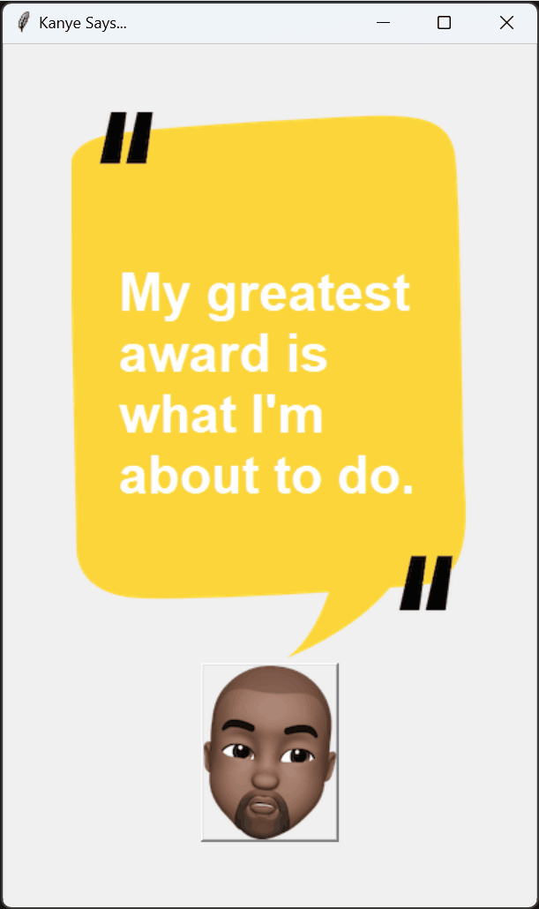

# Day 33: Understanding APIs

## Overview
On Day 33 of learning Python, I focused on understanding what an API is, how API endpoints work, and how to use API parameters to customize data retrieval. This day culminated in the creation of two projects:
1. **ISS Overhead Notifier**: Sends an email notification when the International Space Station (ISS) is overhead.
2. **Kanye Quotes App**: A GUI application that displays random Kanye West quotes using the Kanye Rest API.

## Demo

### Kanye Quotes App


## Files and Structure

### Project Structure
```
📁 Day 33 Projects
├── 📄 main.py
├── 📁 iis_over_head
│   ├── 📄 config.py
│   ├── 📄 main.py
└── 📁 kanye_quotes
    ├── 📄 background.png
    ├── 📄 kanye.png
    └── 📄 playground.py
```

### `main.py`
- **Description:**
  - A script demonstrating how to interact with two different APIs: the ISS Location API and the Sunrise-Sunset API.
  - The script fetches the current position of the ISS and sunrise/sunset times for a specific location using API parameters.
  - The results include the ISS's latitude and longitude, as well as the sunrise and sunset times. 

- **Key Features:**
  - **Fetching ISS Location**: Sends a GET request to the ISS API and retrieves the current latitude and longitude of the ISS.
  - **Sunrise and Sunset Times**: Retrieves sunrise and sunset times for a specific latitude and longitude using the Sunrise-Sunset API.
  - **Datetime Usage**: Demonstrates how to extract and manipulate time data using Python's `datetime` module.

### ISS Overhead Notifier
#### Files:
- **`config.py`**: A placeholder for configuration settings or sensitive data, such as email credentials. Currently, this file is empty and can be used to store any environment-specific configurations.

- **`main.py`**
  - **Description:**
    - A script that checks if the ISS is overhead at a specific location and sends an email notification if it is nighttime.
    - Uses the ISS Location API to determine the ISS's position and the Sunrise-Sunset API to check if it’s currently night at the given location.
  
  - **Key Functions:**
    - **`is_IIS_overhead()`**: Checks if the ISS's position is within ±5 degrees of the specified latitude and longitude.
    - **`is_night()`**: Determines if it is currently nighttime based on the sunrise and sunset times.
    - **Notification**: Sends an email if both conditions are met—if the ISS is overhead and it's night.

  - **Execution Loop:**
    - The script runs continuously, checking the conditions every 60 seconds and sending an email notification when the conditions are met.

### Kanye Quotes App
#### Files:
- **`background.png`**: A background image used in the Kanye Quotes GUI application.

- **`kanye.png`**: An image of Kanye West used as a button in the Kanye Quotes GUI application.

- **`playground.py`**
  - **Description:**
    - A GUI application that fetches and displays random Kanye West quotes.
    - Uses the Kanye Rest API to retrieve quotes.

  - **Key Functions:**
    - **`get_quote()`**: Sends a GET request to the Kanye Rest API to fetch a random quote and updates the displayed text in the GUI.

  - **GUI Layout:**
    - The application is built using Tkinter.
    - It features a canvas with a background image, a text area for displaying the quote, and a button with Kanye’s image that fetches a new quote when clicked.

## How to Use

### 1. **ISS Overhead Notifier**
   - Replace the placeholder `"ADD_HERE_THE_PASSWORD"` in `main.py` with your actual email password in the `iis_over_head` project.
   - Run the script. It will continuously check every 60 seconds if the ISS is overhead and if it's nighttime, and then send an email notification.

### 2. **Kanye Quotes App**
   - Ensure that the images (`background.png` and `kanye.png`) are in the same directory as `playground.py`.
   - Run `playground.py` to launch the GUI application. Click the Kanye button to retrieve and display a new random Kanye West quote.
