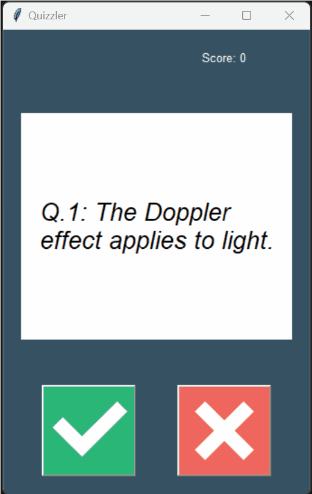

# Day 34: Quiz App Using APIs

## Overview
On Day 34 of learning Python, I created a Quiz App to further practice working with APIs. This project pulls questions from the Open Trivia Database API and provides a fun, interactive quiz experience through a graphical user interface (GUI). The app displays True/False questions, tracks the user's score, and gives instant feedback on each answer.

## Demo


## Files and Structure

### Project Structure
```
📁 Day 34 Projects
├── 📄 data.py
├── 📄 main.py
├── 📄 question_model.py
├── 📄 quiz_brain.py
├── 📄 ui.py
└── 📁 images
    ├── 📄 false.png
    └── 📄 true.png
```

### `data.py`
- **Description:** This script handles data retrieval from the Open Trivia Database API. It fetches 10 True/False questions and their correct answers.
  
- **Key Features:**
  - **API Request:** Sends a GET request to the API with specific parameters to retrieve the quiz questions.
  - **Data Parsing:** Parses the JSON response to extract the questions and correct answers, storing them in the `question_data` variable.

### `main.py`
- **Description:** The main script that initializes and runs the quiz application.
  
- **Key Features:**
  - **Question Bank Creation:** Converts the fetched questions into `Question` objects and stores them in a question bank.
  - **Quiz Initialization:** Instantiates the `QuizBrain` and `QuizInterface` classes to start the quiz.

### `question_model.py`
- **Description:** Defines the `Question` class, which models each quiz question.
  
- **Key Features:**
  - **Attributes:** 
    - `text`: Stores the question text.
    - `answer`: Stores the correct answer (True/False).

### `quiz_brain.py`
- **Description:** Contains the logic for managing quiz progression, checking answers, and tracking the score.
  
- **Key Features:**
  - **Quiz Progression:** Tracks the current question number and whether there are remaining questions.
  - **Answer Checking:** Compares the user's answer with the correct answer and updates the score accordingly.
  - **HTML Unescaping:** Handles HTML entities in the question text to ensure proper display.

### `ui.py`
- **Description:** The graphical user interface (GUI) for the quiz application, built using the Tkinter library.
  
- **Key Features:**
  - **Main Window:** Creates a Tkinter window with a title, background color, and padding.
  - **Score Display:** Displays the current score at the top of the window.
  - **Question Canvas:** A canvas widget that displays the current question.
  - **Buttons:** True/False buttons for answering the questions. These buttons trigger functions that check the user's answer and provide visual feedback.
  - **Question Navigation:** Automatically loads the next question after each answer and disables the buttons when the quiz is over.

### `images/`
- **Description:** This directory contains the images used in the quiz application.
  
- **Files:**
  - **`false.png`**: Image displayed on the False button.
  - **`true.png`**: Image displayed on the True button.

## How to Use

1. **Run the Application:**
   - Execute `main.py` to start the quiz app. The application will display questions fetched from the Open Trivia Database API.

2. **Answering Questions:**
   - Use the True/False buttons to answer each question. The app will provide instant feedback by changing the background color of the question area (green for correct, red for incorrect).

3. **End of Quiz:**
   - After answering all questions, the app will display a message indicating that the quiz is complete and disable the True/False buttons.
