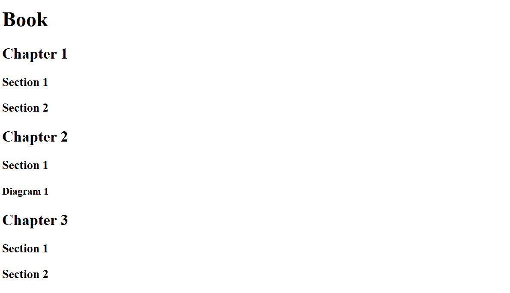

# Day 41: Web Foundation - Introduction to HTML

## Overview
On Day 41, the focus was on understanding the fundamentals of HTML, the backbone of web development. The learning journey included hands-on practice with basic HTML elements such as headings, paragraphs, and void elements. Additionally, a small project was undertaken to apply the learned concepts in a real-world scenario by creating a movie ranking page. 


## Project Structure
The folder structure includes the following directories and files:

```
2.1 Heading Element/
    - goal.png
    - index.html
    - solution.html

2.2 Paragraph Element/
    - goal.png
    - index.html
    - solution.html

2.3 Void Elements/
    - goal.png
    - index.html
    - solution.html

2.4 Movie Ranking Project/
    - goal.png
    - index.html
    - solution.html
    - test.html
```

### 2.1 Heading Element


This exercise focuses on the correct use of heading elements (`<h1>` to `<h6>`) in HTML. The goal was to structure content in a logical hierarchy, ensuring that the headings are semantically correct and reflect the content's organization.

- **goal.png**: A reference image showing the desired output for the heading structure.
- **index.html**: My HTML file where the headings are organized in a book-like structure with chapters and sections.
- **solution.html**: The final solution provided by the course with the correct heading hierarchy.

### 2.2 Paragraph Element


This exercise involved working with the `<p>` tag, which is used to define paragraphs in HTML. The goal was to practice creating and formatting multiple paragraphs of text.

- **goal.png**: A reference image demonstrating how the paragraphs should be structured.
- **index.html**: My HTML file that contains multiple paragraphs formatted using the `<p>` tag, each containing a block of placeholder text (Lorem Ipsum).
- **solution.html**: The final version provided by the course of the paragraph structure, showing the correct use of the `<p>` tag.

### 2.3 Void Elements


Void elements are HTML elements that do not have closing tags, such as `<br />` for line breaks and `<hr />` for horizontal rules. This exercise involved learning how to properly use these elements.

- **goal.png**: A reference image illustrating the correct placement of void elements.
- **index.html**: My HTML file that contains text and void elements to demonstrate their use, particularly in formatting addresses and separating content.
- **solution.html**: The final solution provided by the course with the correct application of void elements.

### 2.4 Movie Ranking Project


The Movie Ranking Project is a small practical exercise where the learned HTML concepts are applied to create a webpage listing a personal ranking of movies.

- **goal.png**: A reference image showing the expected outcome of the movie ranking page.
- **index.html**: My file where the movie titles and descriptions are listed using heading and paragraph elements.
- **solution.html**: The completed version provided by the course of the movie ranking page, which includes the proper use of headings, paragraphs, and a horizontal rule.
- **test.html**: A test file demonstrating the auto-completion feature of HTML, where typing an exclamation mark (`!`) and pressing enter generates a basic HTML document structure.

