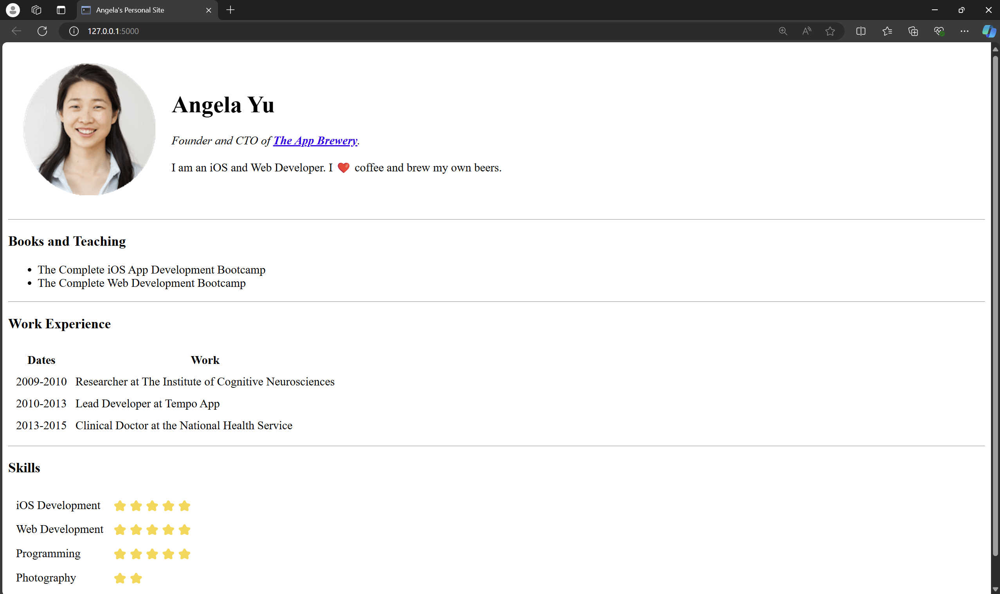
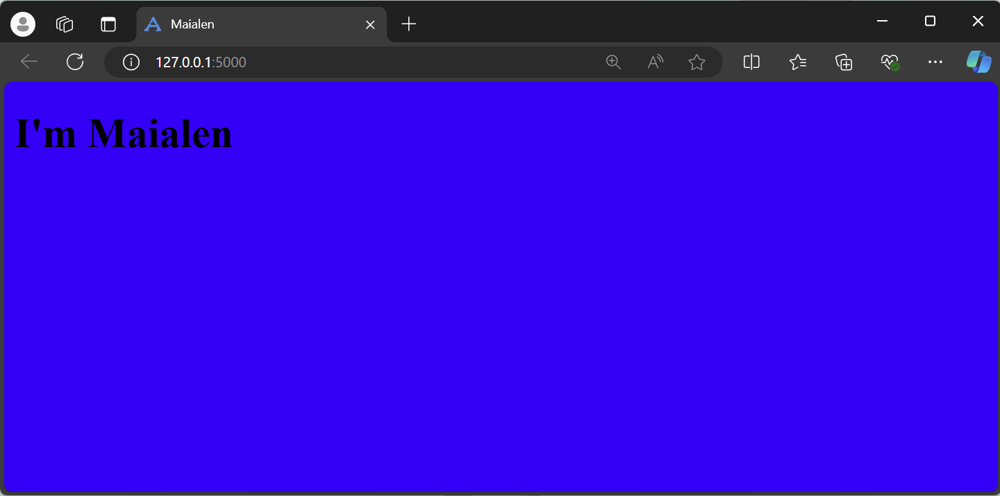

# Day 56: Rendering HTML Static Files and Using Website Templates

## Overview
On Day 56, I learned how to render HTML static files and use website templates with Flask. This involved creating and deploying simple web applications that serve static content, utilizing Flask's template rendering capabilities.

## Project Structure
Here is an overview of the files and directories created:

### `angelas-personal-site-1/`

- **server.py**: A Flask application serving a single HTML file.
- **static/angela.png**: A static image used in the web page.
- **templates/angela.html**: The HTML file rendered by the Flask application.

### `angelas-personal-site-2/`

- **server.py**: A Flask application that serves a homepage.
- **static/favicon.ico**: A favicon used in the browser tab.
- **static/styles.css**: Stylesheet for the web page.
- **static/images/**: Contains images used on the site, including `angela.png`, `chillies.png`, `cloud.png`, and `mountain.png`.
- **templates/index.html**: The main HTML template rendered by the Flask application.

### `my-personal-site/`

- **server.py**: A Flask application serving a personal site.
- **static/styles.css**: Stylesheet for the site.
- **templates/index.html**: The main HTML template for the personal site.

### `my-personal-site-html5up-paradigm-shift-template/`

- **LICENSE.txt**: License information for the template used.
- **README.txt**: Additional information about the template.
- **server.py**: A Flask application using the "Paradigm Shift" template.
- **static/assets/**: Contains CSS, JavaScript, and SASS files for styling and interactivity.
- **static/images/**: Includes images and gallery items for the website.
- **templates/index.html**: The main HTML template for the site.
- **templates/index_old.html**: A backup or older version of the main template.

### `my-personal-site-name-card-website/`

- **LICENSE.txt**: License information for the template used.
- **README.txt**: Additional information about the template.
- **server.py**: A Flask application serving a name card website.
- **static/assets/**: Contains CSS, JavaScript, SASS files, and fonts used in the website.
- **static/images/**: Images used in the website.
- **templates/index.html**: The HTML template for the name card website.

## Key Learnings
- **Flask Routing**: I learned how to create routes in Flask to serve different HTML files.
- **Template Rendering**: I practiced using Flask's `render_template` function to dynamically serve HTML pages.
- **Static Files**: I learned how to serve static files like images, CSS, and JavaScript using Flask.
- **Website Templates**: I explored using pre-built HTML5 templates to create more complex and visually appealing websites.

## Running the Projects
To run any of the projects:
1. Navigate to the project directory.
2. Run the Flask application using the command: `python server.py`.
3. Open a web browser and go to `http://127.0.0.1:5000/` to view the site.
