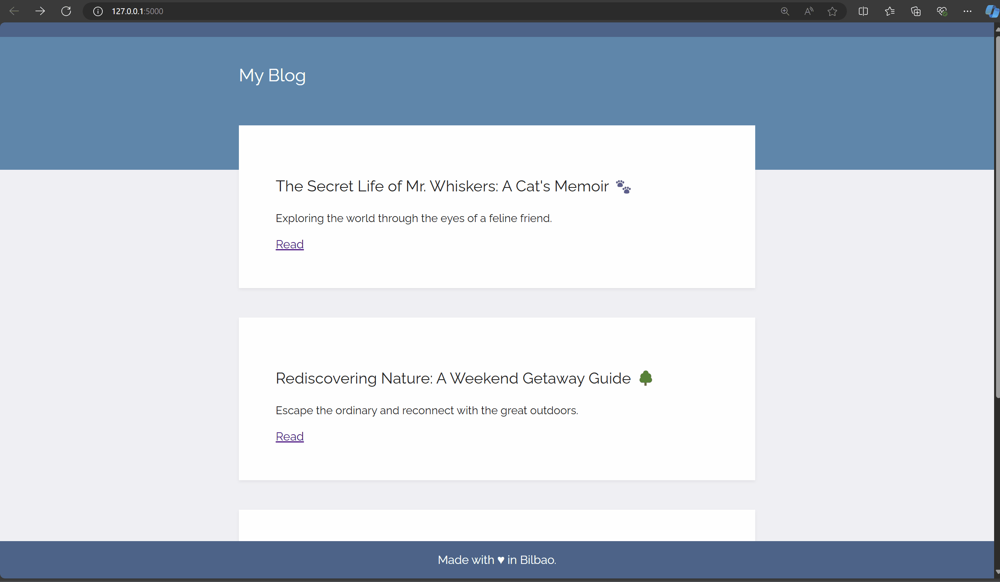

# Day 57: Templating with Jinja in Flask Applications

This project is a simple blog application built using Flask. It fetches blog posts from an external API and renders them on the home page. Each blog post can be viewed in detail on a separate page.

## Demo


## Project Structure

The project is stored in the [capstone-project-blog-with-template](capstone-project-blog-with-template/) folder. The files are:

- **main.py**: The main Python script that sets up and runs the Flask web server. It handles routing for the home page and individual blog posts.
- **post.py**: A Python class that defines the structure of a blog post object with attributes such as `id`, `title`, `subtitle`, and `body`.
- **static/css/styles.css**: The CSS file that contains styles for the blog's HTML pages.
- **templates/index.html**: The HTML template for the home page, which displays a list of blog posts with their titles and subtitles.
- **templates/post.html**: The HTML template for the individual blog post page, displaying the full title, subtitle, and body of a selected post.

## Project Overview

### Instructions Followed:

1. **Download Starting Files**: This project began with provided starting files, which included basic templates and static assets.
   
2. **Running the Application**: Upon running `main.py`, the initial styling and website structure are rendered, providing a basic layout for the blog.

3. **Rendering Blog Posts**: Using an API hosted on n:Point, the project retrieves blog post data, which includes titles, subtitles, and content. These blog posts are displayed on the home page, where each post's title and subtitle are listed.

4. **Creating "Read" Links**: A "Read" anchor tag is added to each blog post preview on the home page. This link directs users to a detailed view of the post, which includes the full title, subtitle, and body of the post. Each post can be accessed via a dynamic URL path in the format: `/post/<blog_id>`.

## How to Run the Application

### Prerequisites
- Python 3.x
- Flask (`pip install flask`)
- Requests library (`pip install requests`)

### Steps to Run

1. **Clone or download** this repository.
2. Navigate to the project directory in your terminal.
3. Install the required Python packages:
   ```
   pip install -r requirements.txt
   ```
   *(Note: You may need to create this `requirements.txt` file, which should include `flask` and `requests`.)*
4. Run the Flask application:
   ```
   python main.py
   ```
5. Open a web browser and navigate to `http://127.0.0.1:5000/` to view the home page.

## Application Routes

- **`/`**: Home page that displays a list of blog posts with their titles and subtitles.
- **`/post/<int:num>`**: Individual blog post page that displays the full content of a selected post. Replace `<int:num>` with the blog post's ID (e.g., `/post/1`).

## External API Used

- **Blog Posts API**: Blog data is fetched from an external API hosted on n:Point (`https://api.npoint.io/36e6b7057201bb6b576a`), which provides JSON data for the blog posts.

## Template Files

- **`index.html`**: The home page template that lists all blog posts with "Read" links.
- **`post.html`**: The individual post template that displays the full content of a blog post.

## Styling

- **`styles.css`**: The stylesheet applied to all HTML templates, providing consistent styling across the home and post pages.
