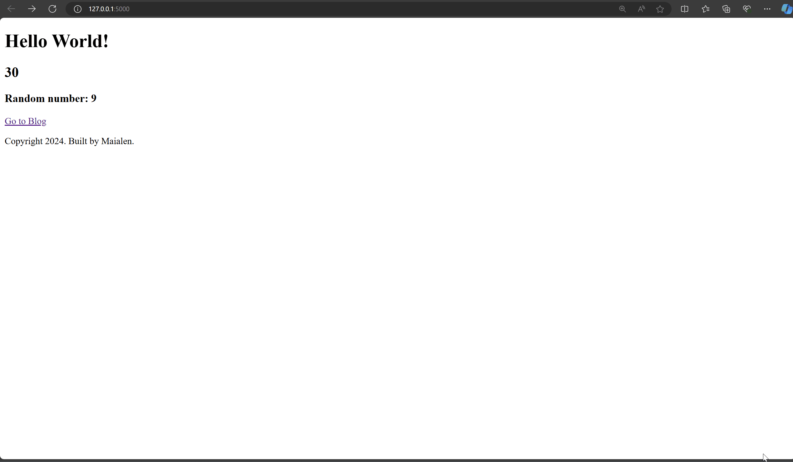

# Flask Web Application

This project is a simple Flask web application that serves multiple pages, including a home page, a name prediction page (guessing age and gender based on a name), and a blog page that fetches and displays posts from an external API.

## Project Structure

- **server.py**: The main Python script that sets up and runs the Flask web server. It handles routing for the home page, name prediction, and blog pages.
- **templates/index.html**: The HTML template for the home page, which displays a random number and the current year.
- **templates/guess-name.html**: The HTML template that displays the predicted age and gender for a given name.
- **templates/blog.html**: The HTML template that displays blog posts fetched from an external API.

## Features

1. **Home Page**:
   - **Route**: `/`
   - Displays a random number and the current year. The random number is generated each time the page is refreshed.

2. **Name Predictor**:
   - **Route**: `/guess/<name>`
   - Predicts the age and gender of a person based on their name using the [Agify API](https://api.agify.io/) and [Genderize API](https://api.genderize.io/).
   - The results are displayed on the `guess-name.html` page.

3. **Blog Page**:
   - **Route**: `/blog/<num>`
   - Fetches and displays a list of blog posts from an external API. The posts are rendered on the `blog.html` page.

## Demo


## How to Run the Application

### Prerequisites
- Python 3.x
- Flask (`pip install flask`)
- Requests library (`pip install requests`)

### Running the Server
1. **Clone or download** this repository.
2. Navigate to the project directory in your terminal.
3. Install the required Python packages:
   ```
   pip install -r requirements.txt
   ```
   *(Note: You may need to create this `requirements.txt` file, which should include `flask` and `requests`.)*
4. Run the Flask application:
   ```
   python server.py
   ```
5. Open a web browser and navigate to `http://127.0.0.1:5000/` to view the home page.

## Application Routes

- **`/`**: Home page displaying a random number and the current year.
- **`/guess/<name>`**: Name prediction page. Replace `<name>` with any name to predict age and gender (e.g., `/guess/John`).
- **`/blog/<num>`**: Blog page that displays posts from an external API. The `<num>` parameter currently does not affect the content displayed but is part of the route structure.

## Template Files

- **`index.html`**: Displays dynamic content like the random number and current year.
- **`guess-name.html`**: Displays the predicted age and gender based on the input name.
- **`blog.html`**: Renders a list of blog posts fetched from an API.

## External APIs Used

- **[Agify API](https://api.agify.io/)**: Predicts the age of a person based on their name.
- **[Genderize API](https://api.genderize.io/)**: Predicts the gender of a person based on their name.
- **[Blog API](https://api.npoint.io/36e6b7057201bb6b576a)**: Provides blog posts for the blog page.
