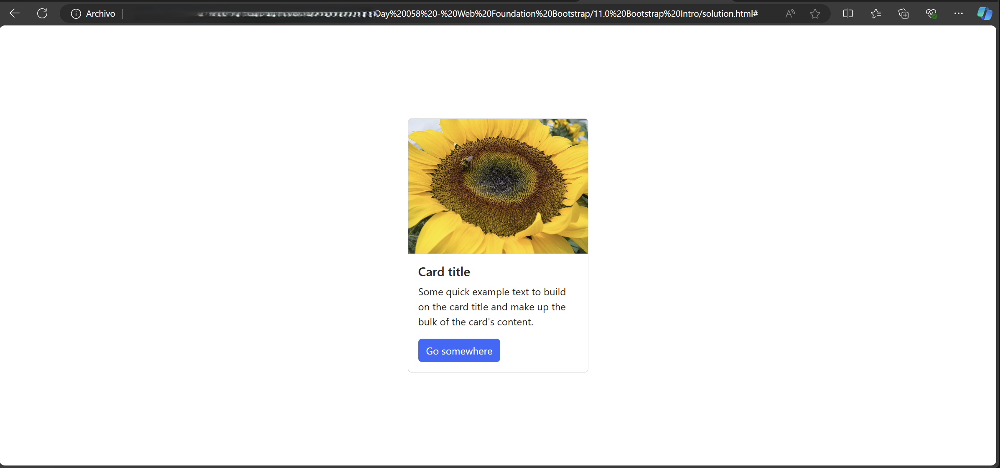

# Day 58: Web Foundation Bootstrap

## Goals for Today
- **Introduction to Bootstrap**: Learn about this popular front-end toolkit to easily layout and format websites, reducing the need for extensive CSS coding.
  - See [Bootstrap Intro](./11.0%20Bootstrap%20Intro/) folder.
- **Bootstrap Layout**: Understand the 12-column grid system that Bootstrap uses for creating responsive layouts.
- **Bootstrap Components**: Discover how to use Bootstrap's pre-built and pre-styled components to enhance web development efficiency.
  - See [Bootstrap Components](./11.2%20Bootstrap%20Components/) folder.
- **Final Project - TinDog**: Apply the knowledge gained by building a startup website, TinDog, using Bootstrap.
  - See [TinDog Project](./11.3%20TinDog%20Project/) folder.

## Demo

### Bootstrap Intro

### Bootstrap Components

### TinDog Project

