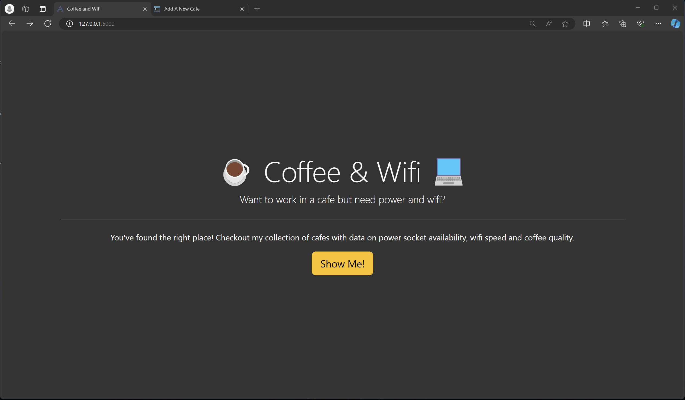

# Coffee and WiFi

A Flask-based web application that allows users to add and browse cafes with ratings for coffee, WiFi, and power socket availability. This project utilizes Flask, WTForms, Bootstrap, and CSV for storing data.

## Demo


## Project Structure

```
├── cafe-data.csv
├── main.py
├── README.md
├── requirements.txt
├── static
│   └── css
│       └── styles.css
└── templates
    ├── add.html
    ├── base.html
    ├── cafes.html
    └── index.html
```

### Files Description

- **cafe-data.csv**: A CSV file that stores the details of cafes, including their name, location, opening and closing times, coffee rating, WiFi strength, and power socket availability.

- **main.py**: The main Python file containing the Flask application. It defines routes for:
  - Home page (`/`)
  - Add a cafe (`/add`)
  - View all cafes (`/cafes`)

- **README.md**: This file, providing an overview of the project, its structure, and how to run it.

- **requirements.txt**: Lists the Python packages required to run this project:
  - `Bootstrap_Flask`
  - `Flask`
  - `Flask_WTF`
  - `WTForms`

- **static/css/styles.css**: Contains custom CSS styles for the project.

- **templates/**: Folder containing HTML templates:
  - **base.html**: The base template that other templates extend.
  - **add.html**: Template for the form to add a new cafe.
  - **cafes.html**: Displays the list of cafes from `cafe-data.csv`.
  - **index.html**: The homepage of the application.

## How to Run

1. **Clone the repository**:
   ```bash
   git clone <repository_url>
   cd <repository_folder>
   ```

2. **Install the required packages**:
   On Windows:
   ```bash
   python -m pip install -r requirements.txt
   ```
   On macOS/Linux:
   ```bash
   pip3 install -r requirements.txt
   ```

3. **Run the Flask application**:
   ```bash
   python main.py
   ```
   The application will be available at `http://127.0.0.1:5000/`.

## Features

- **Add a Cafe**: Users can submit new cafes via a form. The form includes fields for cafe name, location, opening and closing times, and ratings for coffee, WiFi, and power socket availability.
- **View Cafes**: The list of all cafes with their details is displayed on a separate page.
- **Data Storage**: Cafe information is stored in a CSV file (`cafe-data.csv`), making it easy to manage and extend.
