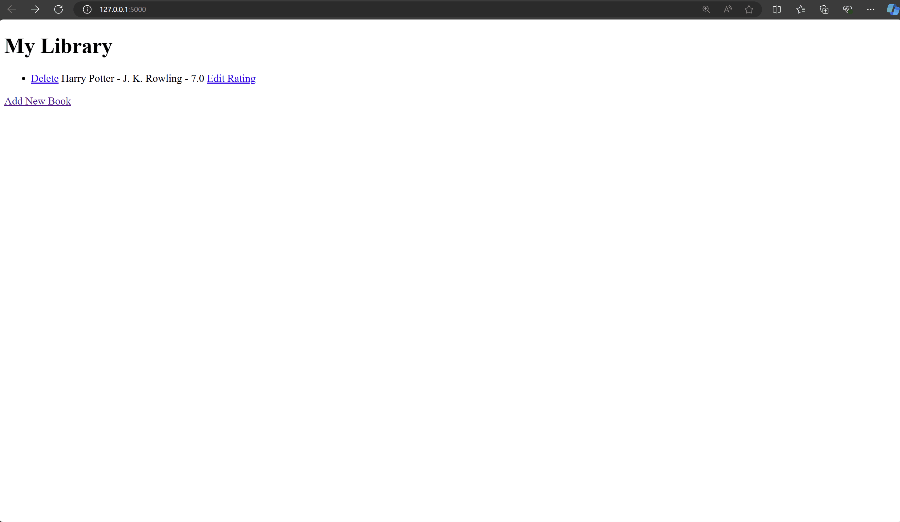

# Day 63: Creating a Virtual Bookshelf with SQLite

## Goals
Today, we’ll build a Virtual Bookshelf application where users can track books they’ve read, rate them, and store this information in a database. We’ll learn how to create and interact with an SQLite database, and integrate it with a Flask web application.

**Concepts:**

- **SQLite** is a simple, file-based database engine used for lightweight data storage.
- **SQLAlchemy** is a Python library that provides tools for database interaction, offering both direct SQL execution and an ORM for working with database tables using Python classes.

## Folders in the repository
- `sqlite-testing`: folder created to test the database and learn SQLAlchemy.
- `flask-website-project`: final project containing a Virtual Bookshelf website.

## Demo

## Steps to Develop the Website

1. **Setup the Project:**
   - **Download the Starting Project:**
     - Download the provided .zip file and unzip it.
     - Open the project in PyCharm. If prompted, create a virtual environment and install the dependencies from `requirements.txt`.
     - If you face issues, manually set up the virtual environment and install packages using the provided commands for Windows or macOS.

2. **Build the Basic Website:**
   - **Home Page (`index.html`):**
     - Ensure the home page displays a header `<h1>` saying "My Library" and a link to add new books.
   - **Add New Book Form (`add.html`):**
     - Create a form to input book details (title, author, rating).
   - **Add Functionality in `main.py`:**
     - Implement functionality to add book details from the form to an `all_books` list.
     - Display books from `all_books` on the home page, and show a message if the library is empty.
   - **Handle Server Refresh:**
     - Note that data is lost upon server restart as it’s stored in memory. We need a database to persist this data.

3. **Introduction to SQLite:**
   - **Create SQLite Database:**
     - Create a new SQLite database file named `books-collection.db`.
   - **Define and Create a Table:**
     - Use `sqlite3` to create a `books` table with fields for `id`, `title`, `author`, and `rating`.
   - **Insert Data:**
     - Add sample data into the `books` table and verify it using DB Browser for SQLite.

4. **Switch to SQLAlchemy:**
   - **Setup SQLAlchemy:**
     - Install `flask`, `SQLAlchemy`, and `flask_sqlalchemy`.
   - **Define Models:**
     - Use SQLAlchemy to define a `Book` model and create the `books` table with the same structure as before.
   - **Perform CRUD Operations:**
     - Learn to Create, Read, Update, and Delete records using SQLAlchemy within Flask’s application context.

5. **Integrate Database with Flask Application:**
   - **Update the Flask Application:**
     - Modify the `/add` route to add books to the SQLite database.
     - Display all books from the database on the home page.
   - **Add Edit and Delete Functionality:**
     - Implement functionality to edit book ratings and delete books directly from the home page.

**Final Challenges:**
1. **Home Page:**
   - Show all books from the database on the home page.
2. **Edit Rating:**
   - Add an option to edit the rating of each book and update the database accordingly.
3. **Delete Book:**
   - Implement a feature to delete books from the database and refresh the home page to reflect changes.

