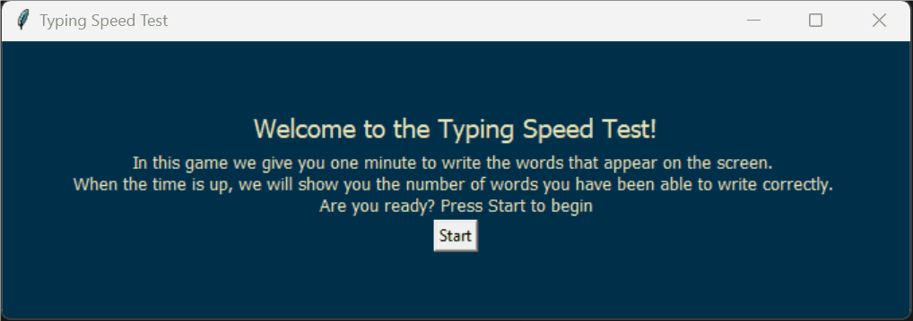

# Typing Speed Test

## Goal
Using Tkinter and the knowledge of building GUI applications with Python, this desktop app assesses your typing speed. It provides the user with sample text and detects how many words they can type per minute.

## How to Use
1. Run the application. You will be welcomed by the start screen.

2. Read the instructions provided on the start screen.

3. Press the "Start" button to begin the typing test.

4. You will have one minute to type the words that appear on the screen.

5. When the time is up, the app will display the number of words you've typed correctly.

## Demo

## Implementation
The application is implemented using Python and the Tkinter library for building the graphical user interface. Colors and font constants are defined to maintain a consistent visual style throughout the application. The main Tkinter event loop starts the application, and the user interface is built with labels, buttons, and an entry widget. The start screen displays the instructions for the game.

The functions developed are:
- start_game(): Clears the start screen elements, initiates the countdown for the typing test and displays the game screen elements.
- count_down(time_counter): Updates the timer display on the canvas with the current time (it is updated every second). Once the time is expires, it removes the current elements and shows the end game screen.
- check_typing(event): Compares the typed word with the expected word and increments the score if they match. Updates the word and clears the text to prepare the game for the next word typing.

## Reflection Time

### Today's learnings
- TKinter GUI Development: I have practiced with different elements (such as labels and buttons) and in addition, explored geometry managers like 'grid'.
- Event Handling: event binding to associate functions with button clicks.
- Countdown Implementation by using TKinter's 'after' method for scheduling.
- GUI Styling: constants for colors and fonts for a consistent visual style.
- Random word selection by using 'random' module.

### Potential improvements for the future
- Game enhancements: Replace the task of typing random words with random phrases for the typing challenge.
- UI/UX enhancements, such as animations and different layout designs.
- New functionalities, such as to implement different difficulty levels and adjust typing test parameters.
- Include typing accuracy metrics alongside typing speed.
