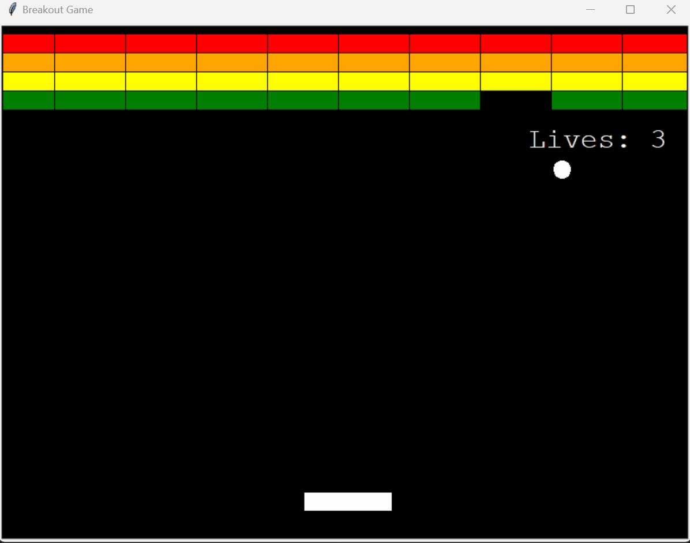

# Breakout Game

## Goal
A simple Breakout game implemented in Python using the Turtle graphics library. Breakout is a classic arcade game where the player controls a paddle to bounce a ball and break a wall of bricks.

To develop this game, the code developed on the 22nd and 23rd of this course has been taken as a reference.

## How to Play
- The player controls the paddle using the left and right arrow keys.

- The ball bounces off walls, the paddle, and bricks.

- The objective is to break all the bricks by bouncing the ball into them.

- If the ball hits the bottom of the screen, the player loses a life.

- The game ends when all lives are exhausted or all bricks are destroyed.

## Demo

## Implementation
### Classes
The game is organized into several classes, each handling different aspects of the game:

- `ball.py`: Contains the `Ball` class, responsible for the ball's movement and interactions.

- `brick.py`: Defines the `Brick` class, representing the individual bricks that the player aims to break.

- `brick_manager.py`: Manages the collection of bricks and their interactions with the ball. Includes the `BrickManager` class.

- `paddle.py`: Implements the `Paddle` class, controlling the player's paddle.

- `scoreboard.py`: Manages the game's scoring, lives, and displays game-over or victory messages. Contains the `Scoreboard` class.

- `main.py`: The main script that orchestrates the game. It creates instances of the various classes, handles user input, and controls the game loop.

### Features
- **Brick management**: Bricks disappear upon collision with the ball, and the game tracks remaining bricks.

- **Scoreboard**: Displays the player's remaining lives, along with game-over and victory messages.

- **Game Over/Win states**: The game ends with a game-over message if all lives are lost and a victory message if all bricks are destroyed.

## Reflection time
### Today's learnings
- **Object-Oriented Programming (OOP)**: usage of classes to model and organize different components of the game (Paddle, Ball, Brick, etc.). Encapsulated functionality within each class, promoting clean and modular code.
- **GUI Development** with Turtle graphics library for simple graphics and animation.
- **Problem-Solving**: Resolved challenges such as ensuring smooth ball movement, effective collision detection, and scoring mechanisms.

### Potential improvements for the future
- Improvements to the current game: 
    - Randomize the direction of the ball at the beginning of the game.
    - Improve the bounce of the ball with the brick, when the ball hits the side (not the bottom) of the brick.

- Implement levels with increasing difficulty.

- Add sound effects and background music.

- Include power-ups or special bricks for additional challenges.

- Improve the game's aesthetics with better graphics.

- Implement a menu system for ease of use.

