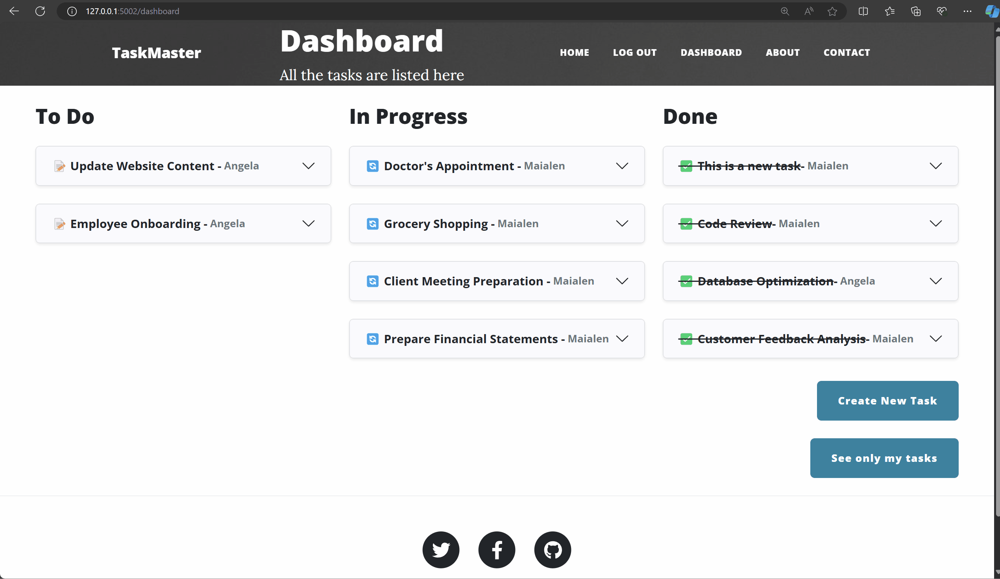

# Day 89: Task Manager Website

Welcome to the Task Manager website, a Kanban-style task list inspired by Trello. This project, developed on Day 89 of my journey, includes various functionalities to help manage tasks efficiently.

## Features

- **Kanban Board**: Visualize tasks in three states: To Do, In Progress, and Done.
- **Task Details**: Each task contains a unique identifier, status, reporter, reporting date, and description.
- **Database Models**: Defines `User`, `Task`, and `Comment` models with their relationships.
- **User Authentication**: Features for user registration, login, and logout with session management.
- **Task Pages**: Each task has its own page where authenticated users can add comments.
- **User Roles and Permissions**: Decorators restrict access to certain routes. E.g. Only the admin user can delete tasks.
- **Website Structure**: Includes a homepage along with About and Contact sections.

## Demo

**User Authentication, Kanban Board and Task Pages**:

**Filter tasks, Logout, Home Page, About and Contact sections**:

**Adding comments to tasks**:

## Technologies Used

### Backend

- **Flask**: A micro web framework for Python.
- **Flask Extensions**:
    - **Flask-Bootstrap**: Integrates Bootstrap to style the web application.
    - **Flask-Gravatar**: Displays profile images based on email addresses using Gravatar.
    - **Flask-Login**: Manages user sessions and authentication.
    - **Flask-SQLAlchemy**: Integrates SQLAlchemy ORM for database operations.
    - **Flask-WTF**: Custom form classes for user input and validation.

- **Werkzeug**: Provides security functions like password hashing (`generate_password_hash` and `check_password_hash`).
- **Jinja2**: Renders HTML templates with dynamic data.

### Other Python Modules

- **Datetime**: Handles date and time operations.
- **Functools**: Creates decorators for higher-order functions (`wraps`).
- **SQLAlchemy**: SQL toolkit and ORM for database interactions.

### Frontend

- **HTML/CSS**: Structures and styles the web pages.

### Database

- **SQLite**: A lightweight, disk-based database for storing data.

